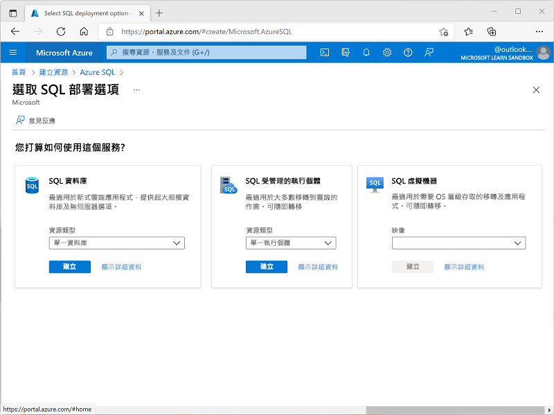
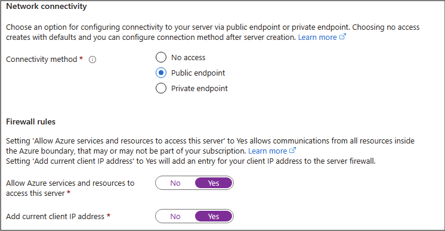
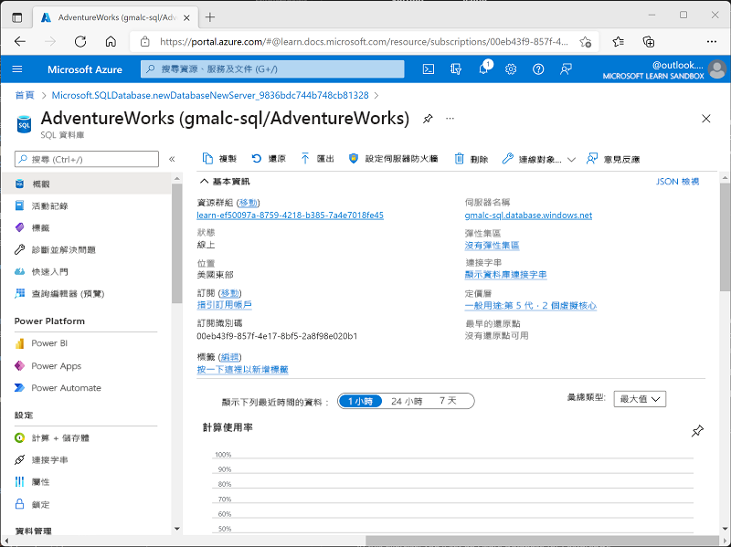
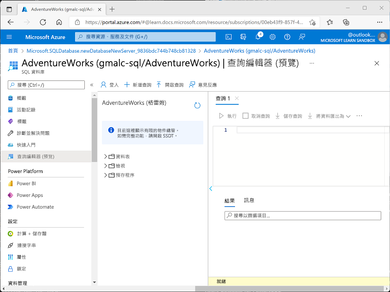
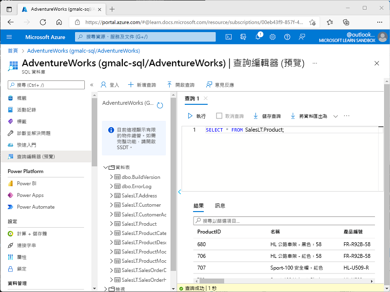

---
lab:
  title: 探索 Azure SQL Database
  module: Explore relational data in Azure
---

# 探索 Azure SQL Database

在此實驗室中，您將瞭解如何佈建 Azure SQL 資料庫，並使用 SQL 查詢與之互動。 您將使用 Microsoft AdventureWorks 範例資料庫，其中提供預先填入的資料表和資料，因此您可以專注於探索和查詢關聯式資料，而不需要建立自己的結構描述或插入範例記錄。 這種方法使事情變得簡單明了，讓您專注於理解核心資料庫概念和 SQL 語法。

此實驗室需要大約 **15** 分鐘才能完成。

## 在您開始使用 Intune 之前

您將需要具有系統管理層級存取權的 [Azure 訂用帳戶](https://azure.microsoft.com/free)。

## 佈建 Azure SQL Database 資源

1. 在 Azure 入口網站[ 中](https://portal.azure.com?azure-portal=true)，選取 &#**65291;從左上角建立資源**，然後搜尋 `Azure SQL`。 然後在產生的 [Azure SQL]**** 頁面中，選取 [建立]****。

    

1. 檢閱可用的 Azure SQL 選項，然後在 [SQL資料庫]**** 圖格中，確定已選取 [單一資料庫]****，然後選取 [建立]****。

    

    > _**提示**： 單一資料庫是針對本實驗室設定的最簡單且最快的資料庫。其他選項會新增您尚不需要的設定。_

1. 在 [建立 SQL Database]**** 頁面上輸入下列值，並將所有其他屬性維持為其預設設定：
    - **訂閱**：選取您的 Azure 訂閱。
    - **資源群組**：以您選擇的名稱建立新的資源群組。
    - **資料庫名稱**：`AdventureWorks`
    - **伺服器**：選取 [新建]****，並在任何可用位置中建立具有唯一名稱的新伺服器。 使用 **SQL 驗證**，並將名稱指定為伺服器管理員登入，並設下合適複雜度的密碼 (請務必記住密碼，稍後會需要用到！)
    - [想使用 SQL 彈性集區嗎？]****：[否]**
    - **工作負載環境**：開發
    - [計算 + 儲存體]****：保持不變
    - [備份儲存體備援]****：[本地異地備援備份儲存體]**

    > _**提示**： SQL 驗證可快速設定最後一次 （無需額外的 Microsoft Entra ID 步驟）。開發預設值更便宜且快速。本地備份是低成本的選擇，對於臨時實踐數據庫來說很好。_

1. 在 [建立 SQL Database]**** 頁面上，選取 [下一步：網路 >]****，然後在 [網路]**** 頁面上的 [網路連線能力]**** 區段中，選取 [公用端點]****。 然後，針對**防火牆規則**區段中的兩個選項選取 [是]****，允許從 Azure 服務和您目前的用戶端 IP 位址存取資料庫伺服器。

    

    > _**提示**：公共端點 + 允許您的 IP 可讓您立即連線。適合短期實驗室。在實際專案中，您通常會更多地鎖定存取。_

1. 選取 [下一步：安全性 >]****，並將 [啟用適用於 SQL 的 Microsoft Defender]**** 選項設定為 [暫時不要]****。

    > _**提示：** Defender 是付費安全性附加元件。我們在這裡跳過它，以保持簡單並避免在短暫的練習中產生成本。_

1. 選取[下一步：其他設定 >]****，然後在 [其他設定]**** 索引標籤上，將 [使用現有的資料]**** 選項設定為 [範例]**** (這會建立範例資料庫，供您稍後探索)。

    > _**提示**： 範例資料提供現成的表格和資料列，讓您立即開始查詢。_

1. 選取 [檢閱 + 建立]****，然後選取 [建立]**** 以建立您的 Azure SQL 資料庫。

1. 等候部署完成。 然後前往已部署的資源，應會如下所示：

    

1. 在頁面左側的窗格中，選取 [查詢編輯器(預覽)] ****，然後使用您為伺服器指定的系統管理員登入名稱和密碼登入。
    
    >**附註**： 如果顯示錯誤訊息，指出不允許用戶端 IP 位址，請選取 **訊息結尾的 [允許清單 IP ...** ] 連結以允許存取，然後嘗試重新登入 （您先前已將自己電腦的用戶端 IP 位址新增至防火牆規則，但查詢編輯器可能會根據您的網路設定從不同的位址連線。
    
    查詢編輯器看起來像這樣：
    
    

1. 展開 [資料表]**** 資料夾查看資料庫中的資料表。

1. 在 [查詢 1]**** 窗格中，輸入下列 SQL 程式碼：

    ```sql
   SELECT * FROM SalesLT.Product;
    ```

    > _**提示**：SELECT *快速顯示每欄和一些值。（在實際應用程序中，您通常會避免它並只選擇您需要的列。_

1. 選取查詢上方的 [&#9655; 執行]**** 執行並檢視結果，其中應該包含 **SalesLT.Product** 資料表中所有資料列的所有資料行，如下所示：

    

1. 以下列程式碼取代 SELECT 陳述式，然後選取 [&#9655; 執行]**** 執行新的查詢，並檢閱結果 (其中僅包含 **ProductID**、**名稱**、**ListPrice**、**ProductCategoryID** 資料行)：

    ```sql
   SELECT ProductID, Name, ListPrice, ProductCategoryID
   FROM SalesLT.Product;
    ```

    > _**提示**： 只列出您需要的資料行，可讓結果變小，並執行得更快。_

1. 現在請嘗試下列查詢，該查詢會使用 JOIN 從 **SalesLT.ProductCategory** 資料表取得類別名稱：

    ```sql
    SELECT 
        p.ProductID, 
        p.Name AS ProductName,
        c.Name AS Category, 
        p.ListPrice
    FROM SalesLT.Product AS p
    INNER JOIN SalesLT.ProductCategory AS c 
        ON p.ProductCategoryID = c.ProductCategoryID;
    ```

    > _**提示**： JOIN 顯示如何使用相符的 ID 從另一個表格提取相關資料 （種類名稱）。_

1. 關閉查詢編輯器窗格並捨棄編輯。

> _**提示**： 如果您已完成探索 Azure SQL 資料庫，您可以刪除您在本練習中建立的資源群組。刪除資源群組會在一個步驟中移除所有資源。它還最大限度地降低了成本。_
