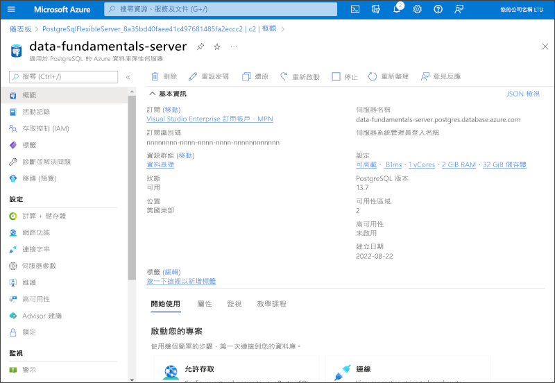

---
lab:
  title: 探索適用於 PostgreSQL 的 Azure 資料庫
  module: Explore relational data in Azure
---

# 探索適用於 PostgreSQL 的 Azure 資料庫

在此練習中，需在您的 Azure 訂用帳戶中佈建適用於 PostgreSQL 資源的 Azure 資料庫。

此實驗室需要大約 **5** 分鐘才能完成。

## 在您開始使用 Intune 之前

您將需要具有系統管理層級存取權的 [Azure 訂用帳戶](https://azure.microsoft.com/free)。

## 佈建適用於 PostgreSQL 的 Azure 資料庫資源

在此練習中，需佈建適用於 PostgreSQL 資源的 Azure 資料庫。

1. 在 Azure 入口網站中，選取左上角的 [&#65291; 建立資源]****，並搜尋*適用於 PostgreSQL 的 Azure 資料庫*。 然後在生成的 [適用於 PostgreSQL 的 Azure 資料庫]**** 頁面中，選取 [建立]****。

1. 檢閱適用於 PostgreSQL 的 Azure 資料庫可用的選項，再從 [適用於 PostgreSQL 的 Azure 資料庫]**** 磚中，選取 [彈性伺服器 (建議)]****，然後選取 [建立]****。

    

1. 在 [建立 SQL Database]**** 頁面上輸入下列值：
    - **訂閱**：選取您的 Azure 訂閱。
    - **資源群組**：以您選擇的名稱建立新的資源群組。
    - **伺服器名稱**：輸入唯一名稱。
    - **區域**：選取您附近的區域。
    - **PostgreSQL 版本**：保持不變。
    - **工作負載類型**：選取 [開發]****。
    - **計算 + 儲存體**：保持不變。
    - **可用性區域**：保持不變。
    - **啟用高可用性**：保持不變。
    - **系統管理使用者名稱**：您的名稱。
    - **密碼**和**確認密碼**：複雜性合適的密碼。

1. 選取 [下一步：**網路]**。

1. 在 [防火牆規則]**** 下，選取 [&#65291; 新增目前的用戶端 IP 位址]****。

1. 選取 [檢閱 + 建立]****，然後選取 [建立]**** 以建立 Azure PostgreSQL 資料庫。

1. 等候部署完成。 然後前往已部署的資源，應會如下所示：

    

1. 檢閱管理適用於 PostgreSQL 的 Azure 資料庫資源的選項。

> **提示**：如果您已完成探索適用於 PostgreSQL 的 Azure 資料庫，則可刪除您在此練習中建立的資源群組。
