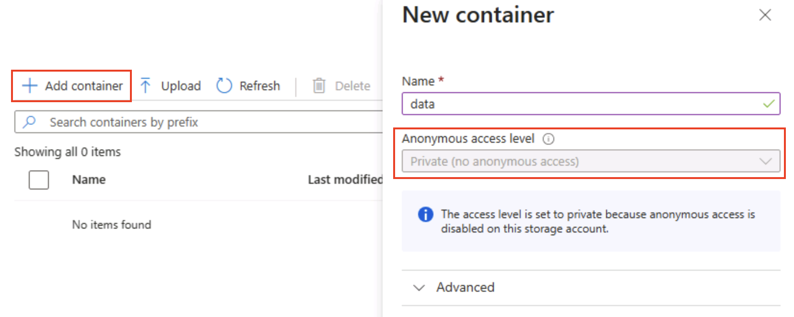
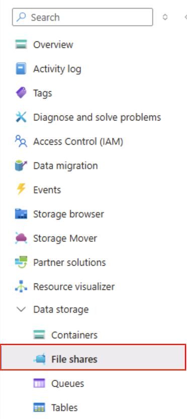

---
lab:
  title: 探索 Azure 儲存體
  module: Explore Azure Storage for non-relational data
---

# 探索 Azure 儲存體

在本練習中，您將瞭解如何佈建和設定 Azure 儲存體 帳戶，並探索其核心服務：Blob 儲存體、Data Lake Storage Gen2、Azure 檔案儲存體和 Azure 資料表。 您將獲得建立容器、上傳資料、啟用階層式命名空間、設定檔案共用和管理資料表實體的實務經驗。 這些技能可協助您瞭解如何在 Azure 中儲存、組織及保護非關聯式資料，以用於各種分析和應用程式案例。

此實驗室需要大約 **15** 分鐘才能完成。

> _**提示**：瞭解每個動作的目的，可協助您稍後設計平衡成本、效能、安全性和分析目標的儲存解決方案。這些簡短的「為什麼」註釋將每一步都與現實世界的原因聯繫起來。_

## 在您開始使用 Intune 之前

您將需要具有系統管理層級存取權的 [Azure 訂用帳戶](https://azure.microsoft.com/free)。

## 佈建 Azure 儲存體帳戶

使用 Azure 儲存體的第一個步驟是在您的 Azure 訂用帳戶中佈建 Azure 儲存體帳戶。

> _**提示**： 儲存體帳戶是所有 Azure 儲存體服務 （Blob、檔案、佇列、資料表） 的安全、可計費界限。原則、備援、加密、網路和存取控制從這裡開始適用。_

1. 如果您尚未這麼做，請登入 [Azure 入口網站](https://portal.azure.com?azure-portal=true)。

1. 在 Azure 入口網站 首頁上，選取 **&#65291;從左上角建立資源**，然後搜尋 `Storage account`。 然後在產生的 [儲存體帳戶]**** 頁面中，選取 [建立****]。

    

1. 在 [建立儲存體帳戶]**** 頁面上，輸入下列值：
   
    - **訂閱**：選取您的 Azure 訂閱。
    - **資源群組**：以您選擇的名稱建立新的資源群組。
    - **儲存體帳戶名稱**：使用小寫字母和數字輸入儲存體帳戶的唯一名稱。
    - **區域**：選取任何可用的位置。
    - **效能**：[標準]**
    - **備援**：[本地備援儲存體 (LRS)]**

    

    > _**提示**： 新的資源群組可讓您輕鬆清理。標準 + LRS 是成本最低的基準，適合學習。LRS 會在一個區域中保留三個同步複本，足以處理非重要的示範資料，而不需要支付異地複寫費用。_

1. 選取 [下一步：進階 >]****，然後檢視進階組態選項。 請特別注意，您可以在其中啟用階層命名空間來支援 Azure Data Lake Storage Gen2。 將此選項 **<u>保留為清除狀態</u>** （您稍後會啟用它），然後選取 **[下一步：網路>** 以檢視儲存體帳戶的網路選項。
   
   

1. 選取 [下一步：資料保護 >]****，然後在 [復原]**** 區段中，「取消」<u></u>選取所有 [啟用虛刪除...]**** 選項。 這些選項會保留已刪除的檔案以供後續復原，但當您稍後啟用階層命名空間時，可能會造成問題。

    

1. 繼續檢視其餘的 [下一步 >]**** 頁面，而不變更任何預設設定，然後在 [檢閱]**** 頁面上，等候您的選項經過驗證，即可選取 [建立]**** 以建立您的 Azure 儲存體帳戶。

1. 等候部署完成。 接著前往已部署的資源。

## 探索 Blob 儲存體

擁有 Azure 儲存體帳戶後，現在您可以建立 Blob 資料的容器。

> _**提示**： 容器會將 Blob 分組，而且是存取控制的第一個範圍層級。從純 Blob 儲存體 （無階層式命名空間） 開始，會顯示您稍後將與 Data Lake Gen2 比較的虛擬資料夾行為。_

1. 從 `https://aka.ms/product1.json` 下載 [product1.json](https://aka.ms/product1.json?azure-portal=true) JSON 檔案，並儲存在您的電腦上 (可儲存在任何資料夾中 - 您稍後會將該檔案上傳至 Blob 儲存體)。

    *如果 JSON 檔案顯示在瀏覽器中，請以滑鼠右鍵按一下頁面，然後選取 **另存新檔**。將檔案  **命名為product1.json** 並將其儲存在您的下載資料夾中。* 

2. 在儲存體容器的 Azure 入口網站頁面上，選取位於左側 [資料儲存體****] 區段中的 [容器****]。
   
    

3. 在 [容器] **** 頁面中，選取 **&#65291;新增容器**，並新增名為「私人」（無匿名存取）**匿名**存取層級的新容器`data`。

    

    > _**提示**：私人可確保您的範例資料安全無虞。除了靜態網站或開放資料案例外，很少需要公開存取。命名它 `data` 使這個例子簡單易讀。_

4. 建立 [資料]**** 容器後，確認 [容器****] 頁面中列出了該容器。

5. 從左側窗格的頂端區段中，選取 [儲存體瀏覽器]****。 此頁面提供瀏覽器型介面，可讓您用來處理儲存體帳戶中的資料。

6. 在儲存體瀏覽器頁面中，選取 [Blob 容器****]，並確認您的 [資料]**** 容器已列出。

7. 選取 [資料]**** 容器，目前沒有任何內容。

    

8. 選擇&# **65291;新增目錄** 並讀取資料夾的相關資訊，然後再建立名為 `products`的新目錄。

9. 在儲存體瀏覽器中，確認目前的檢視顯示了剛建立的 [產品]**** 資料夾內容 - 觀察頁面頂端的「階層連結」是否反映出 **Blob 容器 > 資料 > 產品**的路徑。

    

10. 在階層連結中，選取 [資料]**** 以切換至 [資料]**** 容器，注意其中<u>沒有</u>名為 [產品]**** 的資料夾。

    Blob 儲存體中的資料夾是虛擬的，而且只存在於 Blob 的路徑中。 由於 [產品]**** 資料夾未包含任何 Blob，所以實際上並不存在！

    > _**提示**：平面命名空間表示目錄只是名稱前綴（products/file.json）。此設計可啟用大規模規模，因為服務會索引 Blob 名稱，而不是維護真正的樹狀結構。_

11. 使用 [&#10514; 上傳]**** 按鈕開啟 [上傳 Blob]**** 面板。

12. 在 [上傳 Blob****] 面板中，選取您先前儲存在本機電腦上的 **product1.json** 檔案。 然後在 進階 區**段的 上傳至資料夾** 方塊中**，輸入`product_data`並選取 **上傳**** 按鈕。

    

    > _**提示**： 上傳時提供資料夾名稱會自動建立虛擬路徑，說明 Blob 的存在會顯示「資料夾」。_

13. 關閉 [上傳 Blob]**** 面板 (如果仍然開啟)，並確認已在 [資料]**** 容器中建立 [產品_資料]**** 虛擬資料夾。

14. 選取 [產品_資料]**** 資料夾，並確認其中含有您上傳的 **product1.json** Blob。

15. 在左側的 [資料儲存體****] 區段中，選取 [容器****]。

16. 開啟 [資料]**** 容器，並確認您建立的 [產品_資料]**** 資料夾已列出。

17. 選取 **&#x2027;&#x2027;&#x2027;** 圖示，並注意功能表不會顯示任何選項。 一般命名空間 Blob 容器中的資料夾是虛擬的，而且無法管理。

    

    > _**提示**： 沒有實際目錄物件存在，因此沒有重新命名/權限作業 — 這些作業需要階層式名稱空間。_

18. 使用 [資料]**** 頁面右上角的 **X** 圖示關閉頁面，並返回 [容器]**** 頁面。

## 探索 Azure Data Lake Storage Gen2

Azure Data Lake Store Gen2 支援可讓您使用階層式資料夾來組織和管理 Blob 的存取權。 它也可讓您使用 Azure Blob 儲存體來託管常見巨量資料分析平台的分散式檔案系統。

> _**提示**： 開啟階層式命名空間會讓資料夾的行為與實際目錄類似。它還可以讓您安全地執行資料夾操作（一次完成，沒有錯誤），並為您提供類似於 Linux 中的檔案權限控制。這在使用 Spark 或 Hadoop 等大數據工具時，或在管理大型、有組織的資料湖時特別有用。_

1. [從下載`https://aka.ms/product2.json`product2.json](https://aka.ms/product2.json?azure-portal=true) JSON 檔案，並將其儲存在您先前下載**product1.json**的相同資料夾中的電腦上，您稍後會將它上傳至 Blob 儲存體。

1. 在儲存體容器的 Azure 入口網站頁面左側，向下捲動至 [設定]**** 區段，然後選取 [Data Lake Gen2 升級]****。

    

1. 在 [ **Data Lake Gen2 升級** ] 頁面中，展開並完成每個步驟以升級儲存體帳戶，以啟用階層式命名空間並支援 Azure Data Lake Storage Gen。 這可能需要一些時間。

    

    > _**提示**：升級是帳戶層級功能切換 — 資料會保留，但目錄語意會變更以支援進階作業。_

1. 升級完成後，在左側窗格的頂端區段中，選取 [儲存體瀏覽器]****，然後返回 [資料]**** Blob 容器的根目錄，其中仍包含 [產品_資料]**** 資料夾。

1. 選取 [產品_資料]**** 資料夾，並確認其中仍包含您先前上傳的 **product1.json** 檔案。

1. 使用 [&#10514; 上傳]**** 按鈕開啟 [上傳 Blob]**** 面板。

1. 在 [上傳 Blob****] 面板中，選取您先前儲存在本機電腦上的 **product2.json** 檔案。 然後，選取 **[上傳]** 按鈕。

1. 關閉 [上傳 Blob]**** 面板 (如果仍然開啟)，並確認 [產品_資料]**** 資料夾現已包含 **product2.json** 檔案。

    

    > _**提示**： 升級後新增第二個檔案可確認順暢的連續性：現有的 Blob 仍可運作，而新 Blob 會獲得階層式優點，例如目錄 ACL （存取控制清單）。_

1. 在左側的 [資料儲存體****] 區段中，選取 [容器****]。

1. 開啟 [資料]**** 容器，並確認您建立的 [產品_資料]**** 資料夾已列出。

1. 選取資料夾右端的 **&#x2027;&#x2027;&#x2027;** 圖示，請注意啟用階層命名空間後，您可以在資料夾層級執行設定工作，包括重新命名資料夾和設定權限。

    

    > _**提示**： 實際資料夾可讓您在資料夾粒度上套用最低許可權安全性、安全地重新命名，以及加速遞迴清單，而不是掃描數千個前置詞的 Blob 名稱。_

1. 使用 [資料]**** 頁面右上角的 **X** 圖示關閉頁面，並返回 [容器]**** 頁面。

## 探索 Azure 檔案儲存體

Azure 檔案儲存體提供建立雲端式檔案共用的方法。

> _**提示**： Azure 檔案儲存體 提供 SMB/NFS 端點，適用於隨即轉移案例，其中應用程式需要傳統檔案系統。它透過支援檔案鎖定和作業系統原生工具來補充 （而不是取代） Blob 儲存體。_

1. 在儲存體容器的 Azure 入口網站頁面上，選取位於左側 [資料儲存體****] 區段中的 [檔案共用****]。

    

1. 在 [檔案共用] 頁面中，選取 **&#65291;檔案共用**，並新增使用交易最佳化**層命名**的新`files`檔案共用。

1. 選取 [ **下一步：備份>** 並停用備份]。 然後，選取 [檢閱 + 建立]****。

    

    > _**提示**： 停用備份可降低短期實驗室環境的成本，您可以啟用它以實現生產彈性。_

1. 在 [檔案共用****] 中，開啟新的 [檔案]**** 共用。

1. 選取頁面頂端的 [連線]。**** 然後注意 [連線****] 窗格中有適用於常見作業系統 (Windows、Linux 和 macOS) 的索引標籤，其中包含可執行的指令碼，讓您從用戶端電腦連線到共用資料夾。

    

    > _**提示**： 產生的 Script 確切顯示如何使用平台原生命令掛載共用，說明來自虛擬機器、儲存器或內部部署伺服器的混合式存取模式。_

1. 依序關閉 [連線****] 窗格和 [檔案****] 頁面，以返回 Azure 儲存體帳戶的 [檔案共用****] 頁面。

## 探索 Azure 資料表

Azure 資料表為需要儲存資料值，但不需要完整關聯式資料庫功能和結構的應用程式提供索引鍵/值存放區。

> _**提示**： 資料表儲存體會以豐富的查詢和聯結換取超低成本、無結構描述的彈性和水平擴展，非常適合記錄、IoT 資料或使用者設定檔。_

1. 在儲存體容器的 Azure 入口網站頁面上，選取位於左側 [資料儲存體****] 區段中的 [資料表****]。

    

1. 在 [資料表] **頁面上，選取 **&#65291;** 表格，** 並建立名為 的新表格`products`。

1. 建立 [產品]**** 資料表後，在左側窗格的頂端區段中，選取 [儲存體瀏覽器]****。

1. 在儲存體總管中，選取 [資料表****]，並確認 [產品]**** 資料表已列出。

1. 選取 [產品]**** 資料表：

1. 在 [產品]**** 頁面中，選取 [&#65291; 新增實體]****。

1. 在 [新增實體]**** 面板中，輸入下列索引鍵值：
    - **PartitionKey**：1
    - **RowKey**：1

    > _**提示**： PartitionKey 將相關實體分組以分配負載;RowKey 會在分割區內唯一識別。它們一起形成用於查找的快速複合主鍵。_

1. 選取 [ **新增屬性**]，然後使用下列值建立兩個新屬性：

    |屬性名稱 | 類型 | 值 |
    | ------------ | ---- | ----- |
    | 名稱 | String | Widget |
    | 價格 | Double | 2.99 |

    

1. 選取 [插入****]，將新實體的資料列插入資料表中。

1. 在儲存體瀏覽器中，確認資料列已新增至 [產品]**** 資料表，並已建立 [時間戳記]**** 資料行，以指出資料列上次修改的時間。

1. 將另一個具有下列屬性的實體新增至 [產品]**** 資料表：

    |屬性名稱 | 類型 | 值 |
    | ------------ | ---- | ----- |
    | PartitionKey | String | 1 |
    | RowKey | String | 2 |
    | 名稱 | String | Kniknak |
    | 價格 | Double | 1.99 |
    | 已終止 | 布林值 | true |

    > _**提示**：新增具有不同索引鍵和額外布林屬性的第二個實體，可顯示寫入結構描述的彈性，新屬性不需要移轉。_

1. 插入新的實體之後，請確認資料表中顯示包含已中止產品的資料列。

    您已使用儲存體瀏覽器介面將資料手動輸入資料表。 在實際的案例中，應用程式開發人員可以使用 Azure 儲存體資料表 API，來建置可讀取和寫入資料表值的應用程式，使其成為符合成本效益且可調整的 NoSQL 儲存體解決方案。

> _**提示**： 如果您已完成探索 Azure 儲存體，您可以刪除您在此練習中建立的資源群組。刪除資源群組是避免持續費用的最快方法，方法是移除您在一個動作中建立的每個資源。_
