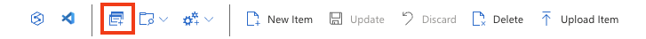
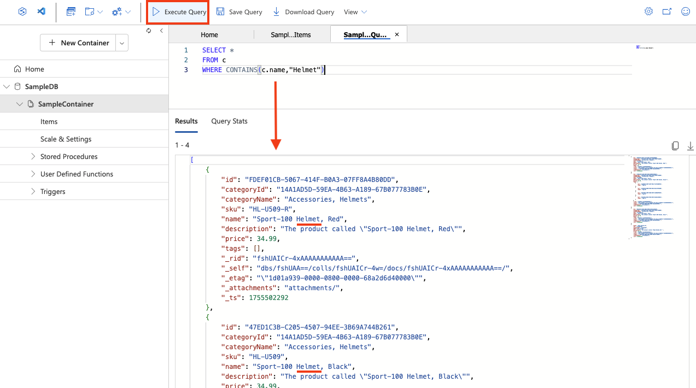

---
lab:
  title: 探索 Azure Cosmos DB
  module: Explore fundamentals of Azure Cosmos DB
---
# 探索 Azure Cosmos DB

完成此實驗室後，您將瞭解如何佈建 Azure Cosmos DB 帳戶、建立範例資料庫和容器、新增和檢視 JSON 專案，以及執行類似 SQL 的查詢來擷取資料。 您將獲得 Azure 入口網站的實作體驗，並了解 Cosmos DB 如何支援彈性的非關聯式資料儲存和查詢。

此實驗室需要大約 **15** 分鐘才能完成。

## 在您開始使用 Intune 之前

您將需要具有系統管理層級存取權的 [Azure 訂用帳戶](https://azure.microsoft.com/free)。

## 建立 Cosmos DB 帳戶

若要使用 Cosmos DB，您必須在 Azure 訂用帳戶中佈建 Cosmos DB 帳戶。 在此練習中，您將佈建使用 Azure Cosmos DB for NoSQL 的 Cosmos DB 帳戶。

1. 在 Azure 入口網站 中，選取**左上方的 [+ 建立資源**]，然後搜尋 `Azure Cosmos DB`。  選取結果中的 **Azure Cosmos DB**，並選取 [建立]****。

    

1. 在 [Azure Cosmos DB for NoSQL]**** 磚中，選取 [建立]****。

    
   
    > _**提示**： 帳戶是 Cosmos DB 資源的最上層。選擇適用於 NoSQL 的 Azure Cosmos DB 可讓您使用簡單的類似 SQL 的查詢語言來儲存和查詢 JSON 資料。_

1. 輸入下列詳細資料，並選取 **[檢閱 + 建立]**：
   
    - **工作負載類型**：學習
    - **訂用帳戶**：若您使用沙箱，請選取 *[指引訂用帳戶]*。 否則請選取您的 Azure 訂閱。
    - **資源群組**：若您使用沙箱，請選取現有的資源群組 (名稱類似 *learn-xxxx...*)。否則，請使用您選擇的名稱建立新的資源群組。
    - **帳戶名稱**：輸入唯一名稱
    - **可用性區域**：停用
    - **位置**：選擇任何建議位置
    - **容量模式**：佈建的輸送量
    - **套用免費層折扣**：若可用，請選取套用
    - **限制帳戶總輸送量**：取消選取
  
    > _**為什麼有這些選擇？**_
    >
    > _我們將工作負載類型**設定**為學習，因為它具有適合初學者的預設值，可讓設定更容易並降低成本。您的**帳戶名稱**必須在整個服務中是唯一的，因為它會成為服務 URL 的一部分。我們會挑選離您較近的位置****，以便您的測試執行得更快;您看到的位置將取決於您的訂用帳戶，以及是否已啟用某些可用性區域。對於**容量模式**，我們將使用佈建輸送量，以便在這個簡短的實驗室期間保持效能可預測，不過如果您只是偶爾需要無伺服器，則沒問題。如果**免費方案**可用，我們將使用它，以便您可以嘗試而不收取費用。最後，我們將關閉「**限制帳戶總吞吐量**」設定，以便在您工作時不會意外減慢任何速度。_

1. 驗證組態後，選取 **[建立]**。

    > _**提示**： Azure 入口網站 會預估佈建此 CosmosDB 執行個體所需的時間。預估建立時間是根據您選擇的位置計算的。_

1. 等候部署完成。 接著，移至所部署的資源。

## 建立範例資料庫

*在此程序進行期間，請關閉入口網站所顯示的任何秘訣*。

1. 在新 Cosmos DB 帳戶的頁面左窗格中，選取 [資料總管]****。

    

1. 在 [資料總管]**** 頁面中，選取 [啟動快速入門]****。

    > _**提示**： 快速入門會建立工作資料庫、容器和範例資料，因此您可以練習新增和查詢項目，而無需先設計綱目。_

1. 在 [新增容器]**** 索引標籤中，檢閱範例資料庫預先填入的設定，並選取 [確定]****。

1. 觀察畫面底部面板的狀態，直到已建立 ** SampleDB** 資料庫及其 **SampleContainer** 容器 (可能需要一分鐘左右)。

## 檢視和建立項目

1. 在 [資料總管] 頁面中展開 **SampleDB** 資料庫和 **SampleContainer** 容器，並選取 [項目]**** 以查看容器中的項目清單。 項目代表產品資料，且各有唯一識別碼與其他屬性。

    

1. 選取清單中的任何項目，以查看項目資料的 JSON 標記法。

1. 選取頁面頂端的 **[新增項目]**，以建立新的空白項目。

1. 修改新項目的 JSON (如下所示)，接著選取 **[儲存]**。

    ```json
   {
       "name": "Road Helmet,45",
       "id": "123456789",
       "categoryID": "123456789",
       "SKU": "AB-1234-56",
       "description": "The product called \"Road Helmet,45\" ",
       "price": 48.74
   }
    ```

    

1. 請注意，儲存新項目後會自動新增其他中繼資料屬性。

    > _**提示**： Cosmos DB 會將專案儲存為 JSON （JavaScript 物件表示法），因此您可以新增符合您案例的欄位，而不需要剛性架構。在容器內必須是唯一的。 `id` 儲存之後，Cosmos DB 會新增系統屬性 （例如時間戳記和內部識別碼） ，以協助管理和優化您的資料：_
    > - *_rid — Cosmos DB 用來在內部識別專案的內部資源識別碼。*
    > - *_self — 項目的完整資源連結。*
    > - *_etag — 用於樂觀並行檢查的實體標籤。*
    > - *_ts — 上次修改項目時的 Unix 時間戳記 （以秒為單位）。*
    > - *_attachments — 文件附件的連結 （如果有的話）。*

## 查詢資料庫

1. 在 **[資料總管]** 頁面中，選取 **[新增 SQL 查詢]** 圖示。

    

1. 在 SQL 查詢編輯器中檢閱預設查詢 (`SELECT * FROM c`)，並使用 **[執行查詢]** 按鈕來執行查詢。

1. 檢閱結果，其中包含所有項目的完整 JSON 標記法。

1. 修改查詢，如下所示：

    ```sql
   SELECT *
   FROM c
   WHERE CONTAINS(c.name,"Helmet")
    ```

    > _**提示**：NoSQL API 會使用熟悉的類似 SQL 的查詢來搜尋 JSON 文件。 `SELECT * FROM c` 列出所有項目，並 `CONTAINS` 依屬性內的文字進行篩選，這對於快速搜尋非常有用，無需額外設定。_

1. 使用 [執行查詢]**** 按鈕來執行修訂的查詢並檢閱結果，其中包含 [名稱]**** 欄位具有「Helmet」文字的項目 JSON 實體。

    

1. 關閉 SQL 查詢編輯器，捨棄您的變更。

    您已了解如何使用 Azure 入口網站中的資料總管介面，在 Cosmos DB 資料庫中建立及查詢 JSON 實體。 在實際案例中，應用程式開發人員會使用眾多程式設計語言專屬軟體開發套件 (SDK) 的其中一項來呼叫 NoSQL API，並使用資料庫中的資料。

> _**提示**： 如果您已完成探索 Azure Cosmos DB，您可以刪除您在本練習中建立的資源群組。_
