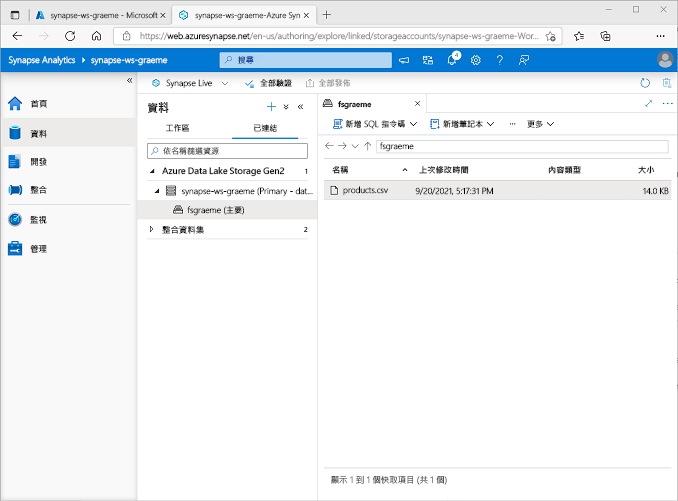
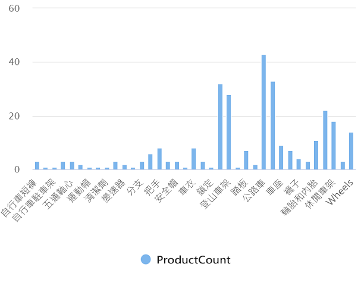
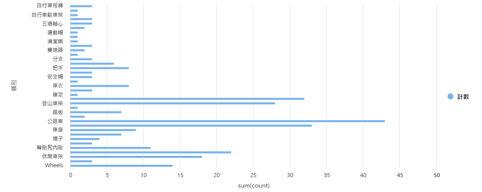

---
lab:
  title: 使用 Azure Synapse Analytice 探索 Azure 中的資料分析
  module: Explore fundamentals of large-scale data warehousing
---

# <a name="explore-data-analytics-in-azure-with-azure-synapse-analytics"></a>使用 Azure Synapse Analytice 探索 Azure 中的資料分析

在此練習中，您必須在自己的 Azure 訂閱中佈建 Azure Synapse Analytics 工作區，用於內嵌和查詢資料。

此實驗室需要大約 **30** 分鐘才能完成。

## <a name="before-you-start"></a>開始之前

您將需要具有系統管理層級存取權的 [Azure 訂用帳戶](https://azure.microsoft.com/free)。

## <a name="provision-an-azure-synapse-analytics-workspace"></a>佈建 Azure Synapse Analytics 工作區

若要使用 Azure Synapse Analytics，您必須在 Azure 訂用帳戶中佈建 Azure Synapse Analytics 工作區資源。

1. 在 [https://portal.azure.com](https://portal.azure.com?azure-portal=true) 開啟 Azure 入口網站，使用與 Azure 訂用帳戶相關聯的認證登入。

    > <bpt id="p1">**</bpt>Tip<ept id="p1">**</ept>:  Ensure you are working in the directory containing your subscription - indicated at the top right under your user ID. If not, select the user icon and switch directory.

2. 在 Azure 入口網站的 [首頁] 頁面上，使用 [&#65291; 建立資源] 圖示來建立新的資源。
3. 搜尋 *Azure Synapse Analytics*，並使用下列設定建立新的 **Azure Synapse Analytics** 資源：
    - **訂用帳戶**：您的 Azure 訂用帳戶
        - **資源群組**：建立具有適當名稱的新資源群組，例如 "synapse-rg"
        - **受控資源群組**：輸入適當的名稱，例如 "synapse-managed-rg"。
    - **工作區名稱**：*輸入唯一的工作區名稱，例如「synapse-ws-<your_name>」* 。
    - **區域**：選取下列任何區域：
        - 澳大利亞東部
        - 美國中部
        - 美國東部 2
        - 北歐
        - 美國中南部
        - 東南亞
        - 英國南部
        - 西歐
        - 美國西部
        - WestUS 2
    - **選取 Data Lake Storage Gen 2**：從訂閱
        - **帳戶名稱**：*建立具有唯一名稱的新帳戶，例如「datalake<your_name>」* 。
        - **檔案系統名稱**：*建立具有唯一名稱的新檔案系統，例如「fs<your_name>」* 。

    > <bpt id="p1">**</bpt>Note<ept id="p1">**</ept>: A Synapse Analytics workspace requires two resource groups in your Azure subscription; one for resources you explicitly create, and another for managed resources used by the service. It also requires a Data Lake storage account in which to store data, scripts, and other artifacts.

4. 輸入這些詳細資料後，請選取 [檢閱 + 建立]，然後選取 [建立] 以建立工作區。
5. 等候建立工作區 - 這可能需要五分鐘的時間。
6. 部署完成後，請移至已建立的資源群組，並注意到其包含您的 Synapse Analytics 工作區和 Data Lake Storage 帳戶。
7. 選取 Synapse 工作區，然後在其 [概觀] 頁面的 [開啟 Synapse Studio] 卡片中，選取 [開啟] 以在新瀏覽器索引標籤中開啟 Synapse Studio。Synapse Studio 是一種 Web 介面，可讓您用來處理 Synapse Analytics 工作區。
8. 在 Synapse Studio 左側，使用 **&rsaquo;&rsaquo;** 圖示展開功能表，這會顯示 Synapse Studio 中的不同頁面，您將使用這些頁面來管理資源和執行資料分析工作，如下所示：

    

## <a name="ingest-data"></a>擷取資料

Azure Synapse Analytics 可執行的主要工作之一是定義「管線」，用以從各種來源將資料轉送 (必要時還轉換) 至工作區來分析。

1. 在 Synapse Studio 的 [首頁]，選取 [內嵌]，然後選擇 [內建複製工作]，以開啟**複製資料工具**。
2. 在複製資料工具的 [屬性] 步驟中，確定已選取 [內建複製工作] 和 [立即執行一次]，然後按 [下一步 >]。
3. 在 [來源] 步驟的 [資料集] 子步驟中，選取下列設定：
    - **來源類型**：全部
    - **連線**：*建立新連線，並在出現的 **[連結服務]** 窗格中選取 **[檔案]** 索引標籤上的 **[HTTP]**。接著使用下列設定繼續進行，並建立資料檔案的連線：*
        - **名稱**：AdventureWorks 產品
        - **描述**：透過 HTTP 的產品清單
        - **透過整合執行階段連線**：AutoResolveIntegrationRuntime
        - **基底 URL**：`https://raw.githubusercontent.com/MicrosoftLearning/DP-900T00A-Azure-Data-Fundamentals/master/Azure-Synapse/products.csv`
        - **伺服器憑證驗證**：啟用
        - **驗證類型**：匿名
4. 建立連線之後，在 [來源/資料集] 子步驟上，確定已選取下列設定，然後選取 [下一步 >]：
    - **相對 URL**：保留空白
    - **要求方法**：GET
    - **其他標題**：保留空白
    - **二進位複本**：「未」<u></u>選取
    - **要求逾時**：保留空白
    - **並行連線數上限**：保留空白
5. 在 [來源] 步驟的 [設定] 子步驟中，選取 [預覽資料] 以查看管線將內嵌的產品資料預覽，然後關閉預覽。
6. 預覽資料之後，在 [來源/設定] 步驟上，確定已選取下列設定，然後選取 [下一步 >]：
    - **檔案格式**：DelimitedText
    - **資料行分隔符號**：逗號 (,)
    - **資料列分隔符號**：換行 (\n)
    - **第一列為標題**：已選取
    - **壓縮類型**：無
7. 在 [目標] 步驟的 [資料集] 子步驟中，選取下列設定：
    - **目標類型**：Azure Data Lake Storage Gen 2
    - **連線**：*選取您資料湖的現有連線 (已在您建立工作區時建立)。*
8. 選取連線後，在 [目標/資料集] 步驟上，確定已選取下列設定，並選取 [下一步 >]：
    - **資料夾路徑**：瀏覽至您的檔系統資料夾
    - **檔案名稱**：products.csv
    - **複製行為**：無
    - **並行連線數上限**：保留空白
    - **區塊大小 (MB)**：保留空白
9. On the <bpt id="p1">**</bpt>Target<ept id="p1">**</ept> step, in the <bpt id="p2">**</bpt>Configuration<ept id="p2">**</ept> substep, ensure that the following properties are selected. Then select <bpt id="p1">**</bpt>Next &gt;<ept id="p1">**</ept>:
    - **檔案格式**：DelimitedText
    - **資料行分隔符號**：逗號 (,)
    - **資料列分隔符號**：換行 (\n)
    - **將標題新增至檔案**：已選取
    - **壓縮類型**：無
    - **每個檔案的資料列數目上限**：保留空白
    - **檔案名稱前置詞**：保留空白
10. 在 [設定] 步驟上，輸入下列設定，然後按 [下一步 >]：
    - **工作名稱**：複製產品
    - **工作描述**：複製產品資料
    - **容錯**：保留空白
    - **啟用記錄**：「未」<u></u>選取
    - **啟用暫存**：「未」<u></u>選取
11. 在 [檢閱並完成] 步驟的 [檢閱] 子步驟上，閱讀摘要，然後按 [下一步 >]。
12. 在 [部署] 步驟中，等候管線部署，然後按一下 [完成]。
13. 在 Synapse Studio 中，選取 [監視] 頁面，然後在 [管線執行] 索引標籤中，等候 [複製產品] 管線的完成狀態為**成功** (您可以使用 [管線執行] 頁面上的 [&#8635; 重新整理] 按鈕來重新整理狀態)。
14. On the <bpt id="p1">**</bpt>Data<ept id="p1">**</ept> page, select the <bpt id="p2">**</bpt>Linked<ept id="p2">**</ept> tab and expand the <bpt id="p3">**</bpt>Azure Data Lake Storage Gen 2<ept id="p3">**</ept> hierarchy until you see the file storage for your Synapse workspace. Then select the file storage to verify that a file named <bpt id="p1">**</bpt>products.csv<ept id="p1">**</ept> has been copied to this location, as shown here:

    

## <a name="use-a-sql-pool-to-analyze-data"></a>使用 SQL 集區分析資料

Now that you've ingested some data into your workspace, you can use Synapse Analytics to query and analyze it. One of the most common ways to query data is to use SQL, and in Synapse Analytics you can use a <bpt id="p1">*</bpt>SQL pool<ept id="p1">*</ept> to run SQL code.

1. 在 Synapse Studio中，以滑鼠右鍵按一下 Synapse 工作區之檔案儲存體中的 **products.csv** 檔案，指向 [新增 SQL 指令碼]，然後選取 [選取前 100 個資料列]。
2. 在開啟的 [SQL Script 1] (SQL 指令碼 1) 窗格中，檢閱已產生的 SQL 程式碼，就像這樣：

    ```SQL
    -- This is auto-generated code
    SELECT
        TOP 100 *
    FROM
        OPENROWSET(
            BULK 'https://datalakexx.dfs.core.windows.net/fsxx/products.csv',
            FORMAT = 'CSV',
            PARSER_VERSION='2.0'
        ) AS [result]
    ```

    此程式碼從您匯入的文字檔中開啟資料列集，並擷取前 100 個資料列的資料。

3. 在 [連線到] 清單中，確定已選取 [內建] - 這代表隨工作區一起建立的內建 SQL 集區。
4. 在工具列上，使用 [&#9655; 執行] 按鈕來執行 SQL 程式碼，然後檢閱結果，看起來應該像這樣：

    | C1 | c2 | c3 | c4 |
    | -- | -- | -- | -- |
    | ProductID | ProductName | 類別 | ListPrice |
    | 771 | Mountain-100 Silver, 38 | Mountain Bikes | 3399.9900 |
    | 772 | Mountain-100 Silver, 42 | Mountain Bikes | 3399.9900 |
    | ... | ... | ... | ... |

5. Note the results consist of four columns named C1, C2, C3, and C4; and that the first row in the results contains the names of the data fields. To fix this problem, add a HEADER_ROW = TRUE parameters to the OPENROWSET function as shown here (replacing <bpt id="p1">*</bpt>datalakexx<ept id="p1">*</ept> and <bpt id="p2">*</bpt>fsxx<ept id="p2">*</ept> with the names of your data lake storage account and file system), and then rerun the query:

    ```SQL
    SELECT
        TOP 100 *
    FROM
        OPENROWSET(
            BULK 'https://datalakexx.dfs.core.windows.net/fsxx/products.csv',
            FORMAT = 'CSV',
            PARSER_VERSION='2.0',
            HEADER_ROW = TRUE
        ) AS [result]
    ```

    現在結果看起來像這樣：

    | ProductID | ProductName | 類別 | ListPrice |
    | -- | -- | -- | -- |
    | 771 | Mountain-100 Silver, 38 | Mountain Bikes | 3399.9900 |
    | 772 | Mountain-100 Silver, 42 | Mountain Bikes | 3399.9900 |
    | ... | ... | ... | ... |

6. 如下所示修改查詢 (以您的 data lake storage 帳戶和檔案系統名稱取代 *datalakexx* 和 *fsxx*)：

    ```SQL
    SELECT
        Category, COUNT(*) AS ProductCount
    FROM
        OPENROWSET(
            BULK 'https://datalakexx.dfs.core.windows.net/fsxx/products.csv',
            FORMAT = 'CSV',
            PARSER_VERSION='2.0',
            HEADER_ROW = TRUE
        ) AS [result]
    GROUP BY Category;
    ```

7. 執行修改後的查詢，應該會傳回包含每個類別產品數目的結果集，如下所示：

    | 類別 | ProductCount |
    | -- | -- |
    | Bib Shorts | 3 |
    | Bike Racks | 1 |
    | ... | ... |

8. In the <bpt id="p1">**</bpt>Properties<ept id="p1">**</ept> pane for <bpt id="p2">**</bpt>SQL Script 1<ept id="p2">**</ept>, change the <bpt id="p3">**</bpt>Name<ept id="p3">**</ept> to <bpt id="p4">**</bpt>Count Products by Category<ept id="p4">**</ept>. Then in the toolbar, select <bpt id="p1">**</bpt>Publish<ept id="p1">**</ept> to save the script.

9. 關閉 [Count Products by Category] (依類別計算產品) 指令碼窗格。

10. 在 Synapse Studio 中，選取 [開發] 頁面，注意您已在此儲存發佈的 [Count Products by Category] (依類別計算產品)。

11. Select the <bpt id="p1">**</bpt>Count Products by Category<ept id="p1">**</ept> SQL script to reopen it. Then ensure that the script is connected to the <bpt id="p1">**</bpt>Built-in<ept id="p1">**</ept> SQL pool and run it to retrieve the product counts.

12. 在 [結果] 窗格中，選取 [圖表] 檢視，然後選取圖表的下列設定：
    - **圖表類型**：直條圖
    - **類別資料行**：類別
    - **圖例 (數列) 資料行**：ProductCount
    - **圖例位置**：正下方
    - **圖例 (數列) 標籤**：保留空白
    - **圖例 (數列) 最小值**：保留空白
    - **圖例 (數列) 上限**：保留空白
    - **類別標籤**：保留空白

    產生的圖表應像這樣：

    

## <a name="use-a-spark-pool-to-analyze-data"></a>使用 Spark 集區來分析資料

While SQL is a common language for querying structured datasets, many data analysts find languages like Python useful to explore and prepare data for analysis. In Azure Synapse Analytics, you can run Python (and other) code in a <bpt id="p1">*</bpt>Spark pool<ept id="p1">*</ept>; which uses a distributed data processing engine based on Apache Spark.

1. 在 Synapse Studio 中，選取 [管理] 頁面。
2. 選取 [Apache Spark 集區] 索引標籤，然後使用 [&#65291; 新增] 圖示，建立具有下列設定的新 Spark 集區：
    - **Apache Spark 集區名稱**：spark
    - **節點大小系列**：記憶體最佳化
    - **節點大小**：小型 (4 顆虛擬核心 / 32 GB)
    - **自動調整**：已啟用
    - **節點數目**：3----3
3. 檢閱並建立 Spark 集區，然後等候部署 (這可能需要幾分鐘)。
4. When the Spark pool has been deployed, in Synapse Studio, on the <bpt id="p1">**</bpt>Data<ept id="p1">**</ept> page, browse to the file system for your Synapse workspace. Then right-click <bpt id="p1">**</bpt>products.csv<ept id="p1">**</ept>, point to <bpt id="p2">**</bpt>New notebook<ept id="p2">**</ept>, and select <bpt id="p3">**</bpt>Load to DataFrame<ept id="p3">**</ept>.
5. 在開啟的 [Notebook 1] (筆記本 1) 窗格中，於 [附加至] 清單中選取先前建立的 [spark] Spark 集區，並確定 [語言] 已設定為 [PySpark (Python)]。
6. (僅) 檢閱筆記本中第一個儲存格的程式碼，看起來就像這樣：

    ```Python
    %%pyspark
    df = spark.read.load('abfss://fsxx@datalakexx.dfs.core.windows.net/products.csv', format='csv'
    ## If header exists uncomment line below
    ##, header=True
    )
    display(df.limit(10))
    ```

7.                  **提示**：請確定位於您訂用帳戶所在的目錄，如右上角的使用者識別碼下方所示。

    > **注意**：如果因為 Python 核心尚無法使用而發生錯誤，請再次執行儲存格。

8. 最後，結果應該會出現在儲存格下方，就像這樣：

    | _c0_ | _c1_ | _c2_ | _c3_ |
    | -- | -- | -- | -- |
    | ProductID | ProductName | 類別 | ListPrice |
    | 771 | Mountain-100 Silver, 38 | Mountain Bikes | 3399.9900 |
    | 772 | Mountain-100 Silver, 42 | Mountain Bikes | 3399.9900 |
    | ... | ... | ... | ... |

9. 取消註解 *,header=True* 行 (因為 products.csv 檔案的第一行是資料行標題)，所以程式碼看起來會像這樣：

    ```Python
    %%pyspark
    df = spark.read.load('abfss://fsxx@datalakexx.dfs.core.windows.net/products.csv', format='csv'
    ## If header exists uncomment line below
    , header=True
    )
    display(df.limit(10))
    ```

10. 重新執行儲存格，並驗證結果如下所示：

    | ProductID | ProductName | 類別 | ListPrice |
    | -- | -- | -- | -- |
    | 771 | Mountain-100 Silver, 38 | Mountain Bikes | 3399.9900 |
    | 772 | Mountain-100 Silver, 42 | Mountain Bikes | 3399.9900 |
    | ... | ... | ... | ... |

    請注意，再次執行儲存格所需時間較少，因為 Spark 集區已啟動。

11. 在結果下，使用 **&#65291; 程式碼**圖示，將新的程式碼儲存格新增至筆記本。
12. 在新的空白程式碼儲存格中，新增下列程式碼：

    ```Python
    df_counts = df.groupBy(df.Category).count()
    display(df_counts)
    ```

13. 選取左邊的 **&#9655; 執行** 圖示以執行新的程式碼儲存格，然後檢閱結果，看起來應該像這樣：

    | 類別 | count |
    | -- | -- |
    | Headsets | 3 |
    | Wheels | 14 |
    | ... | ... |

14. 否則，請選取使用者圖示並切換目錄。

    

15. 關閉 [Notebook 1] (筆記本 1) 窗格並捨棄變更。

## <a name="delete-azure-resources"></a>刪除 Azure 資源

完成探索 Azure Synapse Analytics 後，建議刪除您建立的資源，以免產生不必要的 Azure 成本。

1. 關閉 Synapse Studio 瀏覽器索引標籤，返回 Azure 入口網站。
2. 在 Azure 入口網站的 [首頁] 上，選取 [資源群組]。
3. 選取 Synapse Analytics 工作區的資源群組 (不是受控資源群組)，驗證其包含您工作區的 Synapse 工作區、儲存體帳戶和 Spark 集區。
4. 在資源群組的 [概觀] 頁面頂端，選取 [刪除資源群組]。
5. 輸入資源群組名稱以確認您想要將其刪除，然後選取 [刪除]。

    幾分鐘後，系統將會刪除您的 Azure Synapse 工作區和與其相關聯的受控工作區。
