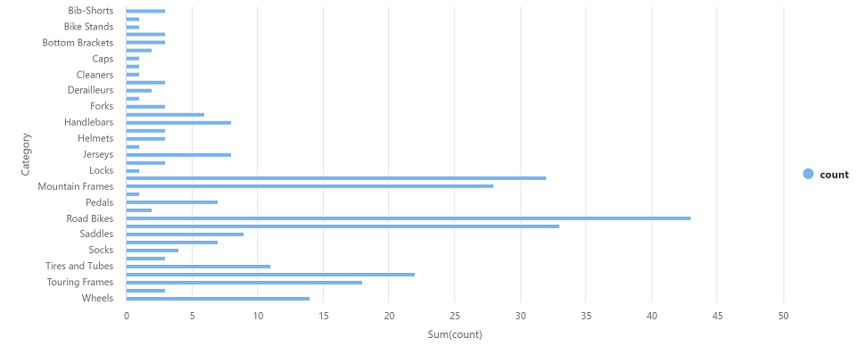

---
lab:
  title: 使用 Azure Synapse Analytice 探索 Azure 中的資料分析
  module: Explore fundamentals of large-scale data warehousing
---

# 使用 Azure Synapse Analytice 探索 Azure 中的資料分析

在此練習中，您必須在自己的 Azure 訂閱中佈建 Azure Synapse Analytics 工作區，用於內嵌和查詢資料。

此實驗室需要大約 **30** 分鐘才能完成。

## 在您開始使用 Intune 之前

您將需要具有系統管理層級存取權的 [Azure 訂用帳戶](https://azure.microsoft.com/free)。

## 佈建 Azure Synapse Analytics 工作區

若要使用 Azure Synapse Analytics，您必須在 Azure 訂用帳戶中佈建 Azure Synapse Analytics 工作區資源。

1. 在 [https://portal.azure.com](https://portal.azure.com?azure-portal=true) 開啟 Azure 入口網站，使用與 Azure 訂用帳戶相關聯的認證登入。

    > **提示**：請確定位於您訂用帳戶所在的目錄，如右上角的使用者識別碼下方所示。 否則，請選取使用者圖示並切換目錄。

2. 在 Azure 入口網站的 [首頁]**** 頁面上，使用 [&#65291; 建立資源]**** 圖示來建立新的資源。
3. 搜尋 Azure Synapse Analytics**，並使用下列設定建立新的 **Azure Synapse Analytics** 資源：
    - **訂用帳戶**：您的 Azure 訂用帳戶**
        - **資源群組**：建立具有適當名稱的新資源群組，例如 "synapse-rg"**
        - **受控資源群組**：輸入適當的名稱，例如 "synapse-managed-rg"**。
    - **工作區名稱**：*輸入唯一的工作區名稱，例如「synapse-ws-<your_name>」*。
    - **區域**：選取下列任何區域**：
        - 澳大利亞東部
        - 美國中部
        - 美國東部 2
        - 北歐
        - 美國中南部
        - 東南亞
        - 英國南部
        - 西歐
        - 美國西部
        - WestUS 2
    - **選取 Data Lake Storage Gen 2**：從訂用帳戶
        - **帳戶名稱**：*建立具有唯一名稱的新帳戶，例如「datalake<your_name>」*。
        - **檔案系統名稱**：*建立具有唯一名稱的新檔案系統，例如「fs<your_name>」*。

    > **注意**：Synapse Analytics 工作區需要 Azure 訂用帳戶中的兩個資源群組：一個用於您明確建立的資源，另一個用於服務所使用的受控資源。 還需要 Data Lake Storage 帳戶來儲存資料、指令碼和其他成品。

4. 輸入這些詳細資料後，請選取 [檢閱 + 建立]****，然後選取 [建立]**** 以建立工作區。
5. 等候工作區建立，可能需要大約五分鐘。
6. 部署完成後，請移至已建立的資源群組，並注意其包含 Synapse Analytics 工作區和 Data Lake Storage 帳戶。
7. 選取 Synapse 工作區，然後在 [概觀]**** 頁面的 [開啟 Synapse Studio]**** 卡片中，選取 [開啟]****，以在新瀏覽器索引標籤中開啟 Synapse Studio。Synapse Studio 是 Web 介面，可用來處理 Synapse Analytics 工作區。
8. 在 Synapse Studio 左側，使用 **&rsaquo;&rsaquo;** 圖示展開功能表，這會顯示 Synapse Studio 中的不同頁面，您將使用這些頁面來管理資源和執行資料分析工作，如下所示：

    

## 內嵌資料

Azure Synapse Analytics 可執行的主要工作之一是定義「管線」**，用以從各種來源將資料轉送 (必要時還轉換) 至工作區來分析。

1. 在 Synapse Studio 的 [首頁]**** 頁面中，選取 [內嵌]**** 開啟 [資料複製工具]**** 工具。
2. 在複製資料工具的 [屬性]**** 步驟中，確定已選取 [內建複製工作]**** 和 [立即執行一次]****，然後按 [下一步 >]****。
3. 在 [來源]**** 步驟的 [資料集]**** 子步驟中，選取下列設定：
    - **來源類型**：全部
    - **連線**：*建立新連線，並在出現的 [新增連線]**** 窗格，選取 [一般通訊協定]**** 索引標籤的 [HTTP]****。接著使用下列設定繼續進行，並建立資料檔案的連線：*
        - **名稱**：AdventureWorks 產品
        - **描述**：透過 HTTP 的產品清單
        - **透過整合執行階段來連線**：AutoResolveIntegrationRuntime
        - **基底 URL**：`https://raw.githubusercontent.com/MicrosoftLearning/DP-900T00A-Azure-Data-Fundamentals/master/Azure-Synapse/products.csv`
        - **伺服器憑證驗證**：啟用
        - **驗證類型**：匿名
4. 建立連線之後，在 [來源/資料集]**** 子步驟上，確定已選取下列設定，然後選取 [下一步 >]****：
    - **相對 URL**：保留空白**
    - **要求方法**：GET
    - **其他標頭**：保留空白**
    - **二進位複本**：<u>「未」</u>選取
    - **要求逾時**：保留空白**
    - **同時連線數上限**：保留空白**
5. 在 [來源]**** 步驟的 [設定]**** 子步驟中，選取 [預覽資料]**** 以查看管線將內嵌的產品資料預覽，然後關閉預覽。
6. 預覽資料之後，在 [來源/設定]**** 步驟上，確定已選取下列設定，然後選取 [下一步 >]****：
    - **檔案格式**：DelimitedText
    - **資料行分隔符號：** 逗號 (,)
    - **資料列分隔符號**：換行 (\n)
    - **第一個資料列做為標頭**：已選取
    - **壓縮類型：** 無
7. 在 [目的地]**** 步驟的 [資料集]**** 子步驟中，選取下列設定：
    - **目的地類型**：Azure Data Lake Storage Gen 2
    - **連線**：*選取您資料湖的現有連線 (已在您建立工作區時建立)。*
8. 選取連線後，在 [目的地/資料集]**** 步驟上，確定已選取下列設定，然後選取 [下一步 >]****：
    - **資料夾路徑**：瀏覽至您的檔系統資料夾**
    - **檔案名稱**：products.csv
    - **複製行為**：無
    - **同時連線數上限**：保留空白**
    - **區塊大小 (MB)**：保留空白**
9. 在 [目的地]**** 步驟的 [設定]**** 子步驟中，確定已選取下列屬性。 然後，選取 [下一步 >]****：
    - **檔案格式**：DelimitedText
    - **資料行分隔符號：** 逗號 (,)
    - **資料列分隔符號**：換行 (\n)
    - **將標頭新增至檔案**：已選取
    - **壓縮類型：** 無
    - **每個檔案的資料列數目上限**：保留空白**
    - **檔案名稱前置詞**：保留空白**
10. 在 [設定]**** 步驟上，輸入下列設定，然後按 [下一步 >]****：
    - **工作名稱**：複製產品
    - **工作描述**：複製產品資料
    - **容錯**：保留空白**
    - **啟用記錄**：<u>「未」</u>選取
    - **啟用暫存**：<u>「未」</u>選取
11. 在 [檢閱並完成]**** 步驟的 [檢閱]**** 子步驟上，閱讀摘要，然後按 [下一步 >]****。
12. 在 [部署]**** 子步驟上，等候管線部署，然後按一下 [完成]****。
13. 在 Synapse Studio 中，選取 [監視]**** 頁面，然後在 [管線執行]**** 索引標籤中，等候 [複製產品]**** 管線的完成狀態為**成功** (您可以使用 [管線執行] 頁面上的 [&#8635; 重新整理]**** 按鈕來重新整理狀態)。
14. 在 [資料]**** 頁面上，選取 [已連結]**** 索引標籤，然後展開 [Azure Data Lake Storage Gen 2]**** 階層，直到看到 Synapse 工作區的檔案儲存體為止。 然後選取檔案儲存體，以確認名為 **products.csv** 的檔案已複製到此位置，如下所示：

    

## 使用 SQL 集區來分析資料

既然已將一些資料內嵌到工作區，接下來可以使用 Synapse Analytics 來查詢和分析資料。 查詢資料最常用的方式之一是使用 SQL，在 Synapse Analytics 中，您可以使用「SQL 集區」** 來執行 SQL 程式碼。

1. 在 Synapse Studio 中，從 Synapse 工作區的檔案儲存體中以滑鼠右鍵按一下 **products.csv** 檔案，指向 [新增 SQL 指令碼]****，然後選取 [選取前 100 個資料列]****。
2. 在開啟的 [SQL 指令碼 1]**** 窗格中，檢閱已產生的 SQL 程式碼，應該類似如下：

    ```SQL
    -- This is auto-generated code
    SELECT
        TOP 100 *
    FROM
        OPENROWSET(
            BULK 'https://datalakexx.dfs.core.windows.net/fsxx/products.csv',
            FORMAT = 'CSV',
            PARSER_VERSION='2.0'
        ) AS [result]
    ```

    此程式碼從您匯入的文字檔中開啟資料列集，並擷取前 100 個資料列的資料。

3. 在 [連線到]**** 清單中，確定已選取 [內建]**** - 這代表隨工作區一起建立的內建 SQL 集區。
4. 在工具列上，使用 [&#9655; 執行]**** 按鈕來執行 SQL 程式碼，然後檢閱結果，看起來應該像這樣：

    | C1 | c2 | c3 | c4 |
    | -- | -- | -- | -- |
    | ProductID | ProductName | 類別 | ListPrice |
    | 771 | Mountain-100 Silver, 38 | Mountain Bikes | 3399.9900 |
    | 772 | Mountain-100 Silver, 42 | Mountain Bikes | 3399.9900 |
    | ... | ... | ... | ... |

5. 請注意，結果中包含 C1、C2、C3 和 C4 這四個資料行，結果中的第一個資料列包含資料欄位的名稱。 若要解決此問題，請將 HEADER_ROW = TRUE 參數新增至 OPENROWSET 函式，如下所示 (將 datalakexx** 和 fsxx** 換成您的資料湖儲存體帳戶和檔案系統的名稱)，然後重新執行查詢：

    ```SQL
    SELECT
        TOP 100 *
    FROM
        OPENROWSET(
            BULK 'https://datalakexx.dfs.core.windows.net/fsxx/products.csv',
            FORMAT = 'CSV',
            PARSER_VERSION='2.0',
            HEADER_ROW = TRUE
        ) AS [result]
    ```

    現在結果看起來會像這樣：

    | ProductID | ProductName | 類別 | ListPrice |
    | -- | -- | -- | -- |
    | 771 | Mountain-100 Silver, 38 | Mountain Bikes | 3399.9900 |
    | 772 | Mountain-100 Silver, 42 | Mountain Bikes | 3399.9900 |
    | ... | ... | ... | ... |

6. 如下所示修改查詢 (將 datalakexx** 和 fsxx** 換成您的資料湖儲存體帳戶和檔案系統的名稱)：

    ```SQL
    SELECT
        Category, COUNT(*) AS ProductCount
    FROM
        OPENROWSET(
            BULK 'https://datalakexx.dfs.core.windows.net/fsxx/products.csv',
            FORMAT = 'CSV',
            PARSER_VERSION='2.0',
            HEADER_ROW = TRUE
        ) AS [result]
    GROUP BY Category;
    ```

7. 執行修改後的查詢，傳回的結果集應該包含每個類別的產品數目，如下所示：

    | 類別 | ProductCount |
    | -- | -- |
    | Bib Shorts | 3 |
    | Bike Racks | 1 |
    | ... | ... |

8. 在 [SQL 指令碼 1]**** 的 [屬性]**** 窗格中，將 [名稱]**** 變更為**依類別計算產品數目**。 然後在工具列中，選取 [發佈]**** 以儲存指令碼。

9. 關閉 [依類別計算產品數目]**** 指令碼窗格。

10. 在 Synapse Studio 中，選取 [開發]**** 頁面，注意您發佈的**依類別計算產品數目** SQL 指令碼已儲存在這裡。

11. 選取 [依類別計算產品數目]**** SQL 指令碼以重新開啟。 然後，確定指令碼已連線至**內建** SQL 集區，並執行以擷取產品計數。

12. 在 [結果]**** 窗格中，選取 [圖表]**** 檢視，然後為圖表選取下列設定：
    - **圖表類型**：直條圖
    - **類別資料行**：類別
    - **圖例 (數列) 資料行**：ProductCount
    - **圖例位置**：正下方
    - **圖例 (數列) 標籤**：保留空白**
    - **圖例 (數列) 最小值**：保留空白**
    - **圖例 (數列) 最大值**：保留空白**
    - **類別標籤**：保留空白**

    產生的圖表應該像這樣：

    

## 使用 Spark 集區來分析資料

雖然 SQL 是查詢結構化資料集的常用語言，但許多資料分析師發現 Python 之類的語言也很適合探索和準備要分析的資料。 在 Azure Synapse Analytics 中，您可以在「Spark 集區」** 中執行 Python (和其他) 程式碼，這會使用以 Apache Spark 為基礎的分散式資料處理引擎。

1. 在 Synapse Studio 中，選取 [管理]**** 頁面。
2. 選取 [Apache Spark 集區]**** 索引標籤，然後使用 [&#65291; 新增]**** 圖示，建立具有下列設定的新 Spark 集區：
    - **Apache Spark 集區名稱**：spark
    - **節點大小系列**：記憶體最佳化
    - **節點大小**：小型 (4 個虛擬核心 / 32 GB)
    - **自動調整**：已啟用
    - **節點數目** 3----3
3. 檢閱並建立 Spark 集區，然後等候部署 (可能需要幾分鐘)。
4. Spark 集區部署之後，在 Synapse Studio 的 [資料]**** 頁面上，瀏覽至 Synapse 工作區的檔案系統。 然後以滑鼠右鍵按一下 **products.csv**，指向 [新增筆記本]****，並選取 [載入至 DataFrame]****。
5. 在開啟的 [筆記本 1]**** 窗格中，從 [附加至]**** 清單中選取先前建立的 **spark** Spark 集區，並確定 [語言]**** 設定為 **PySpark (Python)**。
6. 在筆記本的第一個 (且唯一) 儲存格中檢閱程式碼，看起來應該像這樣：

    ```Python
    %%pyspark
    df = spark.read.load('abfss://fsxx@datalakexx.dfs.core.windows.net/products.csv', format='csv'
    ## If header exists uncomment line below
    ##, header=True
    )
    display(df.limit(10))
    ```

7.  選取程式碼儲存格左邊的 **&#9655; 執行** 圖示執行程式碼，並等候結果。 第一次執行筆記本中的儲存格時會啟動 Spark 集區，因此可能需要大約一分鐘才會傳回任何結果。

    > **注意**：如果因為 Python 核心尚無法使用而發生錯誤，請再次執行儲存格。

8. 最後，結果應該會出現在儲存格下方，類似如下：

    | _c0_ | _c1_ | _c2_ | _c3_ |
    | -- | -- | -- | -- |
    | ProductID | ProductName | 類別 | ListPrice |
    | 771 | Mountain-100 Silver, 38 | Mountain Bikes | 3399.9900 |
    | 772 | Mountain-100 Silver, 42 | Mountain Bikes | 3399.9900 |
    | ... | ... | ... | ... |

9. 取消註解 ,header=True** 行 (因為 products.csv 檔案的第一行是資料行標頭)，程式碼看起來會像這樣：

    ```Python
    %%pyspark
    df = spark.read.load('abfss://fsxx@datalakexx.dfs.core.windows.net/products.csv', format='csv'
    ## If header exists uncomment line below
    , header=True
    )
    display(df.limit(10))
    ```

10. 重新執行儲存格，並確認結果看起來像這樣：

    | ProductID | ProductName | 類別 | ListPrice |
    | -- | -- | -- | -- |
    | 771 | Mountain-100 Silver, 38 | Mountain Bikes | 3399.9900 |
    | 772 | Mountain-100 Silver, 42 | Mountain Bikes | 3399.9900 |
    | ... | ... | ... | ... |

    請注意，再次執行儲存格所需時間較少，因為 Spark 集區已啟動。

11. 在結果下，使用 **&#65291; 程式碼**圖示，將新的程式碼儲存格新增至筆記本。
12. 在新的空白程式碼儲存格中，新增下列程式碼：

    ```Python
    df_counts = df.groupBy(df.Category).count()
    display(df_counts)
    ```

13. 選取左邊的 **&#9655; 執行** 圖示以執行新的程式碼儲存格，然後檢閱結果，看起來應該像這樣：

    | 類別 | 計數 |
    | -- | -- |
    | Headsets | 3 |
    | Wheels | 14 |
    | ... | ... |

14. 在儲存格的結果輸出中，選取 [圖表]**** 檢視。 產生的圖表應該像這樣：

    

15. 關閉 [Notebook 1] (筆記本 1)**** 窗格並捨棄變更。

## 刪除 Azure 資源

完成探索 Azure Synapse Analytics 後，建議刪除您建立的資源，以免產生不必要的 Azure 成本。

1. 關閉 Synapse Studio 瀏覽器索引標籤，返回 Azure 入口網站。
2. 在 Azure 入口網站的 [首頁]****，選取 [資源群組]****。
3. 選取您的 Synapse Analytics 工作區的資源群組 (不是受控資源群組)，確認包含您的工作區的 Synapse 工作區、儲存體帳戶和 Spark 集區。
4. 在資源群組的 [概觀]**** 頁面頂端，選取 [刪除資源群組]****。
5. 輸入資源群組名稱以確認要刪除，然後選取 [刪除]****。

    幾分鐘後，將會刪除您的 Azure Synapse Analytics 工作區及其相關聯的受控工作區。
