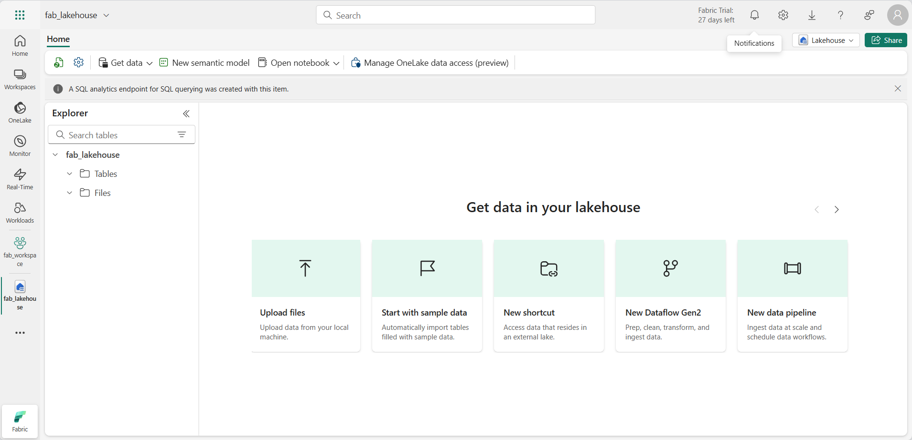

---
lab:
  title: 探索 Microsoft Fabric 的資料分析
  module: Explore fundamentals of large-scale data analytics
---

# 探索 Microsoft Fabric 的資料分析

您將透過此練習探索 Microsoft Fabric Lakehouse 的資料擷取及分析。

此實驗室需要大約 **25** 分鐘才能完成。

> **注意**：您需要 Microsoft Fabric 授權才能完成此練習。 如需如何啟用免費 Fabric 試用版授權的詳細資訊，請參閱[開始使用 Fabric](https://learn.microsoft.com/fabric/get-started/fabric-trial)。 您需要 Microsoft *學校*或*公司*帳戶才能執行此動作。 如您尚未擁有，您可[註冊 Microsoft Office 365 E3 或更高版本的試用版](https://www.microsoft.com/microsoft-365/business/compare-more-office-365-for-business-plans)。

## 建立工作區

在運用 Fabric 的資料之前，請先啟用 Fabric 試用版並建立工作區。

1. 您可在 `https://app.fabric.microsoft.com` 登入 [Microsoft Fabric](https://app.fabric.microsoft.com)。
2. 在左側功能表列，選取 [工作區]**** (圖示看起來類似 )。
3. 以您選擇的名稱建立新工作區，在 [進階]**** 區段選取包含 Fabric 容量 (*試用版*、*進階版*或 *Fabric*) 的授權模式。
4. 當新工作區開啟時，應為空白。

    

## 建立 Lakehouse

現在您已擁有工作區，可切換至入口網站的*資料工程*體驗，並為資料檔案建立資料 Lakehouse。

1. 在入口網站左下方，切換至**資料工程**體驗。

    

    資料工程首頁包含用來建立資料工程資產的常用圖格。

2. 在 [資料工程]**** 首頁，使用您選擇的名稱建立新 **Lakehouse**。

    在約一分鐘之後，將建立新 Lakehouse：

    

3. 檢視新 Lakehouse，並注意左側的 [Lakehouse 總管]**** 窗格可讓您瀏覽 Lakehouse 的資料表與檔案：
    - [資料表]**** 資料夾包含可利用 SQL 查詢的資料表。 Microsoft Fabric Lakehouse 的資料表是以 Apache Spark 常用的 *Delta Lake* 檔案格式為基礎。
    - [檔案]**** 資料夾包含 OneLake 儲存體的資料檔，且其與受管理差異資料表的 Lakehouse 無關。 您也可在此資料夾建立*捷徑*，以便參考外部儲存資料。

    Lakehouse 目前無資料表或檔案。

## 內嵌資料

擷取資料的簡單方式是，利用管線的**複製資料**活動從來源擷取資料，並將其複製到 Lakehouse 的檔案。

1. 在 Lakehouse [首頁]**** 的 [取得資料]**** 功能表，選取 [新增資料管線]****，然後建立名為 [擷取銷售資料]**** 的新資料管線。
1. 在 [複製資料]**** 精靈的  [選擇資料來源]**** 頁面，選取 [Wide World Importers 的零售資料模型]**** 範例資料集。

    ![螢幕擷取畫面：[選取資料來源] 頁面。](./images/choose-data-source.png)

1. 選取 [下一步]****，然後檢視 [連線資料來源]**** 頁面的資料表。
1. 選取包含產品記錄的 [dimension_stock_item]**** 資料表。 然後選取 [下一步]****，繼續進行 [選擇資料目的地]**** 頁面。
1. 在 [選擇資料目的地]**** 頁面，選取現有 Lakehouse。 然後選取**下一步**。
1. 設定下列資料目的地選項，然後選取 [下一步]****：
    - **根資料夾**：資料表
    - **載入設定**：載入至新資料表
    - **目的地資料表名稱**：dimension_stock_item
    - **資料行對應**：*保留預設對應不變*
    - **啟用資料分割**：*未選取*
1. 在 [檢閱 + 儲存]**** 頁面，確定已選取 [立即啟動資料傳輸]**** 選項，然後選取 [儲存 + 執行]****。

    系統會建立包含**複製資料**活動的新管線，如下所示：

    

    當管線開始執行時，您可透過管線設計工具的 [輸出]**** 窗格監視其狀態。 使用 [↻] ****([重新整理]**) 圖示來重新整理狀態，並等到成功為止。

1. 在左側中樞功能表列，選取您的 Lakehouse。
1. 在 [首頁]**** 頁面的 [Lakehouse 總管]**** 窗格，展開 [資料表]****，並確認已建立 [dimension_stock_item]**** 資料表。

    > **注意**：如果新資料表列為*未識別*，請使用 Lakehouse 工具列的 [重新整理]**** 按鈕來重新整理檢視。

1. 選取 [dimension_stock_item]** ** 資料表，並檢視其內容。

    

## 查詢 Lakehouse 的資料

現在您已擷取資料至 Lakehouse 的資料表，您可利用 SQL 來查詢。

1. 在 Lakehouse 頁面右上方，切換至 **Lakehouse 的 SQL 分析端點** 。

    

1. 在工具列，選取 [新增 SQL 查詢]****。 然後，輸入以下 SQL 程式碼至查詢編輯器。

    ```sql
    SELECT Brand, COUNT(StockItemKey) AS Products
    FROM dimension_stock_item
    GROUP BY Brand
    ```

1. 選取 [▷執行]**** 按鈕來執行查詢並檢閱結果，這應會顯示兩個品牌值 (*N/A* 與 *Northwind*)，並顯示其各自產品數目。

    

## 視覺化 Lakehouse 的資料

Microsoft Fabric Lakehouses 會組織語意數據模型中的所有數據表，您可以使用此模型來建立視覺效果和報表。

1. 在頁面左下方的 [總管]**** 窗格底下，選取 [模型]**** 索引標籤並查看 Lakehouse 資料表的資料模型 (在此案例只有單一資料表)。

    

1. 在工具列，選取 [新增報表]**** 並開啟包含 Power BI 報表設計工具的新瀏覽器索引標籤。
1. 在報表設計工具中：
    1. 在 [資料]**** 窗格，展開 [dimension_stock_item]**** 資料表，然後選取 [Brand]**** 與 [StockItemKey]**** 欄位。
    1. 在 [視覺效果]**** 窗格，選取 [堆疊橫條圖]**** 視覺效果 (這是列出的第一個圖表)。 然後，確定 **Y 軸**包含 **Brand** 欄位，並將 **X 軸**的匯總變更為 **Count**，使其包含 **StockItemKey 計數**欄位。 最後，調整報表畫布的視覺效果大小，填滿可用空間。

        

    > **提示**：您可利用 **>>** 圖示來隱藏報表設計工具窗格，以便更清楚看見報表。

1. 在 [檔案] **** 功能表，選取 [儲存]****，以便在 Fabric 工作區將報表儲存為 [品牌數量報表]****。

    您現可關閉包含報表的瀏覽器索引標籤，並返回 Lakehouse。 您可在 Microsoft Fabric 入口網站的工作區頁面找到報表。

## 清除資源

如您已完成探索 Microsoft Fabric，您可刪除您為此練習建立的工作區。

1. 在左側列，選取工作區圖示即可檢視其所包含的所有項目。
2. 在工具列的 [...]**** 功能表，選取 [工作區設定]****。
3. 在 [其他]**** 區段，選取 [移除此工作區]****。
