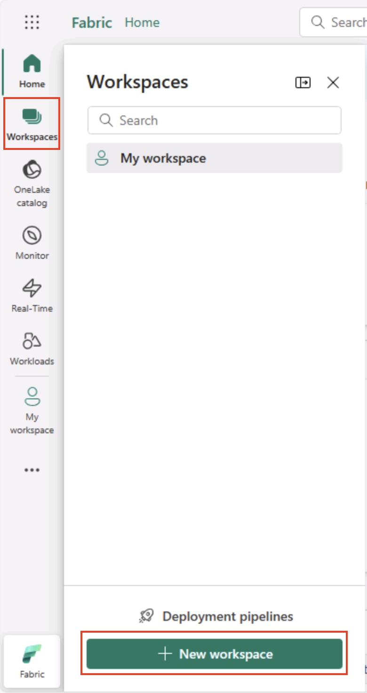

---
lab:
  title: 探索 Microsoft Fabric 的資料分析
  module: Explore fundamentals of large-scale data analytics
---

# 探索 Microsoft Fabric 的資料分析

您將透過此練習探索 Microsoft Fabric Lakehouse 的資料擷取及分析。

完成本實驗室後，您將：

- **瞭解 Microsoft Fabric Lakehouse 概念**：瞭解如何建立工作區和 Lakehouse，這是在 Fabric 中組織和管理資料資產的核心。
- **使用管道**擷取資料：使用引導式管道將外部資料帶入湖屋，使其無需手動編碼即可查詢。
- **使用 SQL** 探索和查詢數據： 使用熟悉的 SQL 查詢分析攝取的數據，直接在 Fabric 中獲得見解。
- **管理資源**： 了解清理資源的最佳實踐，以避免不必要的費用。

## 紐約市出租車數據集的背景：

「NYC Taxi - Green」資料集包含紐約市計程車行程的詳細記錄，包括上車和下車時間、地點、行程距離、票價和乘客人數。 它廣泛用於數據分析和機器學習，用於探索城市交通、需求預測和異常檢測。 在此實驗室中，您將使用此真實世界資料集，在 Microsoft Fabric 中練習資料擷取和分析。

此實驗室需要大約 **25** 分鐘才能完成。

> **注意**：您需要 Microsoft Fabric 授權才能完成此練習。 如需如何啟用免費 Fabric 試用版授權的詳細資訊，請參閱[開始使用 Fabric](https://learn.microsoft.com/fabric/get-started/fabric-trial)。 您需要 Microsoft *學校*或*公司*帳戶才能執行此動作。 如您尚未擁有，您可[註冊 Microsoft Office 365 E3 或更高版本的試用版](https://www.microsoft.com/microsoft-365/business/compare-more-office-365-for-business-plans)。

*第一次使用任何 Microsoft Fabric 功能時，可能會出現提示。駁回這些。*

## 建立工作區

在運用 Fabric 的資料之前，請先啟用 Fabric 試用版並建立工作區。

> _**提示**： 工作區是所有資產 （湖庫、管線、筆記本、報表） 的容器。啟用 Fabric 容量可讓這些專案執行。_

1. 在瀏覽器中流覽至 [Microsoft Fabric 首頁](https://app.fabric.microsoft.com/home?experience=fabric)`https://app.fabric.microsoft.com/home?experience=fabric`，然後使用您的 Fabric 認證登入。

1. 在左側功能表列，選取 [工作區]**** (圖示看起來類似 )。

    

1. 以您選擇的名稱建立新工作區，在 [進階]**** 區段選取包含 Fabric 容量 (*試用版*、*進階版*或 *Fabric*) 的授權模式。

    > _**提示：** 選取包含 Fabric 的容量可為工作區提供資料工程工作所需的引擎。使用專用工作區可使您的實驗室資源保持隔離且易於清理。_

1. 當新工作區開啟時，應為空白。

    

## 建立 Lakehouse

現在您已經有了工作區，是時候為您的資料檔案建立 Lakehouse 了。

> _**提示**： Lakehouse 會將檔案和資料表整合到 OneLake 上。您可以儲存原始檔案，也可以建立可使用 SQL 查詢的受控 Delta 資料表。_

1. 在左側的功能表列上，選取 **[建立**]。 在 [*新增*] 頁面的 [*資料工程師*] 區段下，選取 [**Lakehouse**]。 給它一個您選擇的唯一名稱。

    >**備註**：如果「建立」**** 選項未固定到側邊欄，則需要先選取省略號 （**...**） 選項。

    

    在約一分鐘之後，將建立新 Lakehouse：

    

1. 檢視新 Lakehouse，並注意左側的 [Lakehouse 總管]**** 窗格可讓您瀏覽 Lakehouse 的資料表與檔案：
   
    - **Tables** 資料夾包含您可以使用 SQL 語意查詢的資料表。 Microsoft Fabric Lakehouse 的資料表是以 Apache Spark 常用的 *Delta Lake* 檔案格式為基礎。
    - [檔案]**** 資料夾包含 OneLake 儲存體的資料檔，且其與受管理差異資料表的 Lakehouse 無關。 您也可在此資料夾建立*捷徑*，以便參考外部儲存資料。

    Lakehouse 目前無資料表或檔案。

    > _**提示**：將檔案用於原始或暫存資料，並將表格用於策劃的查詢就緒資料集。資料表由 Delta Lake 支援，因此支援可靠的更新和有效率的查詢。_

## 內嵌資料

擷取資料的簡單方式是，利用管線的**複製資料**活動從來源擷取資料，並將其複製到 Lakehouse 的檔案。

> _**提示**： 管線提供引導式、可重複的方式，將資料帶入湖庫。它們比從頭開始編碼更容易，並且可以在需要時稍後安排。_

1. 在 Lakehouse 的 [首頁 **] 的 [** 取得資料 **] **功能表中，選取 [新增資料管線 **]**，然後建立名為 [擷取資料 **] 的新**資料管線。

    

1. 在 [**複製資料**] 精靈的 [選擇資料來源 **] **頁面上，選取 **[範例資料**]，然後選取 **[紐約市計程車 - 綠色**] 範例資料集。

    

    ![螢幕擷取畫面：[選取資料來源] 頁面。](./images/choose-data-source.png)

1. 在 [連線到資料來源 **] **頁面上，檢視資料來源中的資料表。 應該有一個表格包含紐約市出租車旅行的詳細信息。 然後選取 下一步** 以**繼續前往 連線至資料目的地** 頁面**。

1. 在 [連線到資料目的地 **] **頁面上，設定下列資料目的地選項，然後選取 **[下一步**]：
    - **根資料夾**：資料表
    - **載入設定**：載入至新資料表
    - **目的地資料表名稱**：taxi_rides *（您可能需要等候顯示欄對應預覽，才能變更此設定）*
    - **資料行對應**：*保留預設對應不變*
    - **啟用資料分割**：*未選取*

    

    > _**為什麼有這些選擇？**_
    > 
    > _我們從資料表作為 **根** 目錄開始，因此資料會直接進入受控 Delta 資料表，您可以立即查詢該資料表。我們正在將其載入到一個 **新表** 中，以便此實驗室保持獨立，並且不會覆蓋任何現有內容。我們將堅持使用 **預設欄對應** ，因為範例資料已符合預期的結構，無需自訂對應。 **已關閉分割** 區，以讓這個小型資料集變得簡單;雖然分割區對於大規模資料很有用，但這裡不需要。_

1. 在 [檢閱 + 儲存]**** 頁面，確定已選取 [立即啟動資料傳輸]**** 選項，然後選取 [儲存 + 執行]****。

    > _**提示**： 立即啟動可讓您觀察管線的運作情況，並確認資料已送達，而不需要額外的步驟。_

    系統會建立包含**複製資料**活動的新管線，如下所示：

    

    當管線開始執行時，您可透過管線設計工具的 [輸出]**** 窗格監視其狀態。 使用 **&#8635;** （*重新整理*） 圖示來重新整理狀態，並等待狀態成功 （可能需要 10 分鐘或更長時間）。 這個特定的資料集包含超過 75,000,000 列，儲存了大約 2.5 Gb 的資料。 

1. 在左側中樞功能表列，選取您的 Lakehouse。

    

1. 在 [首頁 **] 的 [** Lakehouse 總管 **] **窗格中，在 [資料表 **] **節點的 [...**] **功能表中，選取 **[重新整理]**，然後展開 **[資料表]**，以確認**已建立taxi_rides**資料表。

    

    > **附註**： 如果新表格列為未識別 *，* 請使用其**重新整理**功能表選項來重新整理視圖。

    > _**提示**： 會快取瀏覽器視圖。重新整理會強制它擷取最新的資料表中繼資料，以便新資料表正確顯示。_

1. 選取taxi_rides**** 表格以檢視其內容。

    

## 查詢 Lakehouse 的資料

現在您已擷取資料至 Lakehouse 的資料表，您可利用 SQL 來查詢。

> _**提示**： Lakehouse 資料表適合 SQL。您可以立即分析資料，而無需將其移至另一個系統。_

1. 在 [Lakehouse] 頁面的右上角，從 Lakehouse** 檢視切換**至 **Lakehouse 的 SQL 分析端點**。

    

    > _**提示**： SQL 分析端點已針對在湖庫資料表上執行 SQL 查詢進行了最佳化，並與熟悉的查詢工具整合。_

1. 在工具列，選取 [新增 SQL 查詢]****。 然後，輸入以下 SQL 程式碼至查詢編輯器。

    ```sql
    SELECT  DATENAME(dw,lpepPickupDatetime) AS Day,
            AVG(tripDistance) As AvgDistance
    FROM taxi_rides 
    GROUP BY DATENAME(dw,lpepPickupDatetime)
    ```

1. 選取&# **9655;執行按鈕** 來執行查詢並檢閱結果，其中應包括一週中每一天的平均行程距離。

    > _**提示**： 此查詢會依日期名稱將行程分組，並計算平均距離，並顯示您可以建置的彙總的簡單範例。_

    

## 清除資源

如您已完成探索 Microsoft Fabric，您可刪除您為此練習建立的工作區。

> _**提示**： 刪除工作區會移除實驗室中建立的所有項目，並有助於防止持續收費。_

1. 在左側列，選取工作區圖示即可檢視其所包含的所有項目。

1. 在工具列中，選取 **[工作區設定**]。

1. 在 [ 一般 ] **區段中，選取 [ **移除此工作區**]。**
