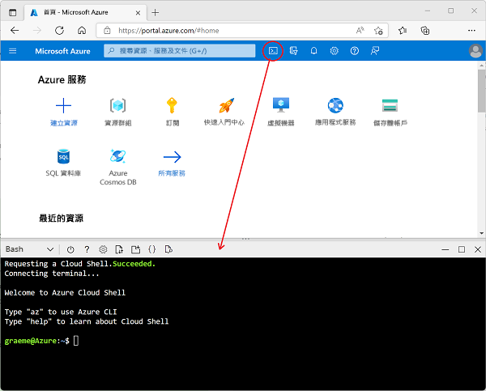

---
lab:
  title: 探索 Azure 串流分析
  module: Explore fundamentals of real-time analytics
---

# 探索 Azure 串流分析

在此練習中，您必須在自己的 Azure 訂閱中佈建 Azure 串流分析作業，用於處理即時資料流。

此實驗室需要大約 **15** 分鐘才能完成。

## 在您開始使用 Intune 之前

您將需要具有系統管理層級存取權的 [Azure 訂用帳戶](https://azure.microsoft.com/free)。

## 建立 Azure 資源

1. 前往 [Azure 入口網站](https://portal.azure.com)，使用您的 Azure 訂閱登入資訊來登入帳戶。

1. 使用頁面頂端搜尋列右側的 ****[\>_] 按鈕，在 Azure 入口網站中建立新的 Cloud Shell，待畫面上出現提示後，選取 ***Bash*** 環境並建立儲存體。 Cloud Shell 會在 Azure 入口網站底部的窗格顯示命令列介面，如下所示：

    

1. 在 Azure Cloud Shell 中，輸入下列命令來下載本練習所需的檔案。

    ```bash
    git clone https://github.com/MicrosoftLearning/DP-900T00A-Azure-Data-Fundamentals dp-900
    ```

1. 等候命令完成，然後輸入下列命令，將當前的目錄變更為包含本練習檔案的資料夾。

    ```bash
    cd dp-900/streaming
    ```

1. 輸入下列命令來執行指令碼，以建立您在本練習中所需的 Azure 資源。

    ```bash
    bash setup.sh
    ```

    > 忽略有關未來變更及實驗性功能的任何警告訊息。

    等候指令碼執行並執行下列動作：

    1. 安裝要建立資源所需的 Azure CLI 擴充功能 (*您可以忽略實驗性擴充功能的任何警告*)
    1. 識別此練習中提供的 Azure 資源群組。
    1. 建立 *Azure IoT 中樞*資源，以供用來接收所模擬裝置的資料串流。
    1. 建立 *Azure 儲存體帳戶*，以供用來儲存已處理的資料。
    1. 建立 *Azure 串流分析*作業，以即時處理傳入的裝置資料，並將結果寫入到儲存體帳戶。

## 探索 Azure 資源

1. 在 [Azure 入口網站](https://portal.azure.com?azure-portal=true)的首頁上，選取 [資源群組]**** 以查看您訂用帳戶中的資源群組。 這應該包含安裝指令碼所識別的 **learn*xxxxxxxxxxxxxxxxx...*** 資源群組。
2. 選取 **learn*xxxxxxxxxxxxxxxxx...*** 資源群組，並檢閱其包含的資源，其中應該包括：
    - 名為 **iothub*xxxxxxxxxxxxx*** 的 *IoT 中樞*，用來接收傳入的裝置資料。
    - 名為 **store*xxxxxxxxxxxx*** 的*儲存體帳戶*，將作為資料處理結果的寫入目的地。
    - 名為 **stream*xxxxxxxxxxxxx*** 的*串流分析作業*，將用來處理串流資料。

    如果這三個資源均未列出，請按一下 [&#8635; 重新整理]**** 按鈕，直到這三個資源出現為止。

3. 選取 **stream*xxxxxxxxxxxxx*** 串流分析作業，並檢視其 [概觀]**** 頁面上的資訊，並記下下列詳細資料：
    - 作業中會有一個名為 **iotinput** 的*輸入*，以及一個名為 **bloboutput** 的*輸出*。 這些資料會參考安裝指令碼所建立的 IoT 中樞和儲存體帳戶。
    - 作業具有*查詢*，其會從 **iotinput** 輸入讀取資料，並藉由計算每 10 秒所處理的訊息數目來加以彙總；將結果寫入到 **bloboutput** 輸出。

## 使用資源來分析串流資料

1. 在串流分析作業的 [概觀]**** 頁面頂端，選取 [&#9655; 啟動]**** 按鈕，然後在 [啟動作業]**** 窗格中，選取 [啟動]**** 以啟動作業。
2. 等候串流作業已成功啟動的通知。
3. 切換回 Azure Cloud Shell，然後輸入下列命令來模擬將資料傳送至 IoT 中樞的裝置。

    ```
    bash iotdevice.sh
    ```

4. 等候模擬開始，如下的輸出會指出這一點：

    ```
    Device simulation in progress: 6%|#    | 7/120 [00:08<02:21, 1.26s/it]
    ```

5. 模擬執行時，回到 Azure 入口網站，返回 **learn*xxxxxxxxxxxxxxxxx...*** 資源群組的頁面，然後選取 **store*xxxxxxxxxxxx*** 儲存體帳戶。
6. 在儲存體帳戶刀鋒視窗左側的窗格中，選取 [容器]**** 索引標籤。
7. 開啟 [資料]**** 容器。
8. 在 [資料]**** 容器中，瀏覽資料夾階層，其中包含目前年份的資料夾，以及月份、日和小時的子資料夾。
9. 在小時的資料夾中，注意已建立的檔案，其名稱應該類似 **0_xxxxxxxxxxxxxxxx.json**。
10. 在檔案的 [...]**** 功能表上選取 [檢視/編輯]****，然後檢閱檔案的內容；這應該包含每 10 秒期間的 JSON 記錄，會顯示從 IoT 裝置接收的訊息數目，如下所示：

    ```
    {"starttime":"2021-10-23T01:02:13.2221657Z","endtime":"2021-10-23T01:02:23.2221657Z","device":"iotdevice","messages":2}
    {"starttime":"2021-10-23T01:02:14.5366678Z","endtime":"2021-10-23T01:02:24.5366678Z","device":"iotdevice","messages":3}
    {"starttime":"2021-10-23T01:02:15.7413754Z","endtime":"2021-10-23T01:02:25.7413754Z","device":"iotdevice","messages":4}
    ...
    ```

11. 使用 [&#8635; 重新整理]**** 按鈕來重新整理檔案，請注意，其他結果會在串流分析作業處理從裝置串流到 IoT 中樞的裝置資料時，即時寫入到檔案。
12. 返回 Azure Cloud Shell，並等候裝置模擬完成 (其應該會執行 3 分鐘左右)。
13. 回到 Azure 入口網站，再次重新整理檔案以查看模擬期間所產生的整組結果。
14. 回到 **learn*xxxxxxxxxxxxxxxxx...*** 資源群組，然後重新開啟 **stream*xxxxxxxxxxxxx*** 串流分析作業。
15. 在 [串流分析作業] 頁面頂端，使用 [&#11036; 停止]**** 按鈕來停止作業，並在出現提示時予以確認。

> **注意**：如果您已完成串流解決方案的探索，請刪除您在此練習中建立的資源群組。
