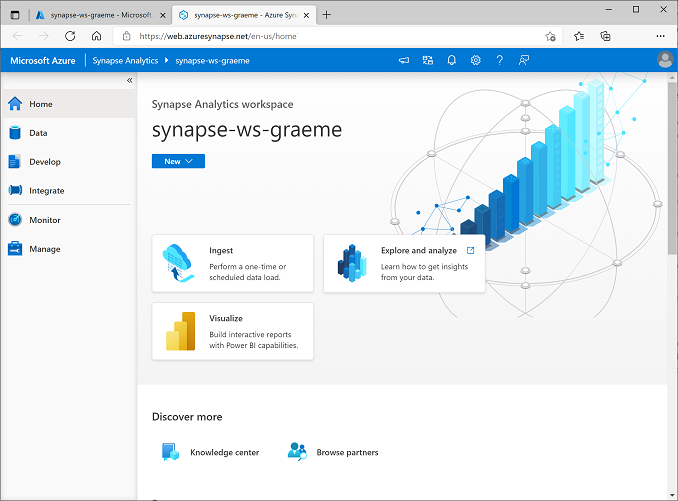

---
lab:
  title: 探索 Azure Synapse Analytics 中的 Spark 串流
  module: Explore fundamentals of real-time analytics
---

# 探索 Azure Synapse Analytics 中的 Spark 串流

在此練習中，您將使用 Azure Synapse Analytics 中的 *Spark 結構化串流*和*差異資料表*來處理串流資料。

此實驗室需要大約 **15** 分鐘才能完成。

## 在您開始使用 Intune 之前

您將需要具有系統管理層級存取權的 [Azure 訂用帳戶](https://azure.microsoft.com/free)。

## 佈建 Synapse Analytics 工作區

若要使用 Synapse Analytics，您必須在 Azure 訂用帳戶中佈建 Synapse Analytics 工作區資源。

1. 在 [[Azure 入口網站]](https://portal.azure.com?azure-portal=true) 開啟 Azure 入口網站，使用與 Azure 訂用帳戶相關聯的認證登入。

    > <bpt id="p1">**</bpt>Note<ept id="p1">**</ept>: Ensure you are working in the directory containing your own subscription - indicated at the top right under your user ID. If not, select the user icon and switch directory.

2. 在 Azure 入口網站的 [首頁] 頁面上，使用 [&#65291; 建立資源] 圖示來建立新的資源。
3. 搜尋 *Azure Synapse Analytics*，並使用下列設定建立新的 **Azure Synapse Analytics** 資源：
    - **訂用帳戶**：您的 Azure 訂用帳戶
        - **資源群組**：建立具有適當名稱的新資源群組，例如 "synapse-rg"
        - **受控資源群組**：輸入適當的名稱，例如 "synapse-managed-rg"。
    - **工作區名稱**：*輸入唯一的工作區名稱，例如「synapse-ws-<your_name>」* 。
    - **區域**：選取任何可用區域。
    - **選取 Data Lake Storage Gen 2**：從訂閱
        - **帳戶名稱**：*建立具有唯一名稱的新帳戶，例如「datalake<your_name>」* 。
        - **檔案系統名稱**：*建立具有唯一名稱的新檔案系統，例如「fs<your_name>」* 。

    > <bpt id="p1">**</bpt>Note<ept id="p1">**</ept>: A Synapse Analytics workspace requires two resource groups in your Azure subscription; one for resources you explicitly create, and another for managed resources used by the service. It also requires a Data Lake storage account in which to store data, scripts, and other artifacts.

4. 輸入這些詳細資料後，請選取 [檢閱 + 建立]，然後選取 [建立] 以建立工作區。
5. 等候建立工作區 - 這可能需要五分鐘的時間。
6. 部署完成後，請移至已建立的資源群組，並注意到其包含您的 Synapse Analytics 工作區和 Data Lake Storage 帳戶。
7. 選取 Synapse 工作區，然後在其 [概觀] 頁面的 [開啟 Synapse Studio] 卡片中，選取 [開啟] 以在新瀏覽器索引標籤中開啟 Synapse Studio。Synapse Studio 是一種 Web 介面，可讓您用來處理 Synapse Analytics 工作區。
8. 在 Synapse Studio 左側，使用 **&rsaquo;&rsaquo;** 圖示展開功能表，這會顯示 Synapse Studio 中的不同頁面，您將使用這些頁面來管理資源和執行資料分析工作，如下所示：

    

## 建立 Spark 集區

若要使用 Spark 來處理串流資料，您必須將 Spark 集區新增至 Azure Synapse 工作區。

1. 在 Synapse Studio 中，選取 [管理] 頁面。
2. 選取 [Apache Spark 集區] 索引標籤，然後使用 [&#65291; 新增] 圖示，建立具有下列設定的新 Spark 集區：
    - **Apache Spark 集區名稱**：sparkpool
    - **節點大小系列**：記憶體最佳化
    - **節點大小**：小型 (4 顆虛擬核心 / 32 GB)
    - **自動調整**：已啟用
    - **節點數目** 3----3
3. 檢閱並建立 Spark 集區，然後等候部署完成 (這可能需要幾分鐘)。

## 探索串流處理

若要使用 Spark 探索串流處理，您將使用包含 Python 程式碼和筆記的筆記本，協助您使用 Spark 結構化串流和差異資料表執行一些基本串流處理。

1. 將 [Structured Streaming and Delta Tables.ipynb](https://github.com/MicrosoftLearning/DP-900T00A-Azure-Data-Fundamentals/raw/master/streaming/Spark%20Structured%20Streaming%20and%20Delta%20Tables.ipynb) 筆記本下載至本地電腦 (如果筆記本是以瀏覽器中的文字檔開啟，請將其儲存到本地資料夾；請小心將其儲存為 **Structured Streaming and Delta Tables.ipynb**，而不是 .txt檔案)
2. 在 Synapse Studio 中，選取 [開發] 頁面。
3. 在 [&#65291;] 功能表上，選取 [&#8612; 匯入]，然後選取本地電腦上的 **Structured Streaming and Delta Tables.ipynb** 檔案。
4. 依照筆記本中的指示將其附加至 Spark 集區，並執行其所包含的程式碼資料格，以探索使用 Spark 進行串流處理的各種方式。

## 刪除 Azure 資源

> <bpt id="p1">**</bpt>Note<ept id="p1">**</ept>: If you intend to complete other exercises that use Azure Synapse Analytics, you can skip this section. Otherwise, follow the steps below to avoid unnecessary Azure costs.

1. 關閉 Synapse Studio 瀏覽器索引標籤而不儲存任何變更，並回到 Azure 入口網站。
1. 在 Azure 入口網站的 [首頁] 上，選取 [資源群組]。
1. 選取 Synapse Analytics 工作區的資源群組 (非受控資源群組)，並確認其包含 Synapse 工作區、儲存體帳戶，以及工作區的資料總管集區 (若您已完成上一個練習，其亦會包含 Spark 集區)。
1. 在資源群組的 [概觀] 頁面頂端，選取 [刪除資源群組]。
1. 輸入資源群組名稱以確認您想要將其刪除，然後選取 [刪除]。

    幾分鐘後，系統將會刪除您的 Azure Synapse 工作區和與其相關聯的受控工作區。
