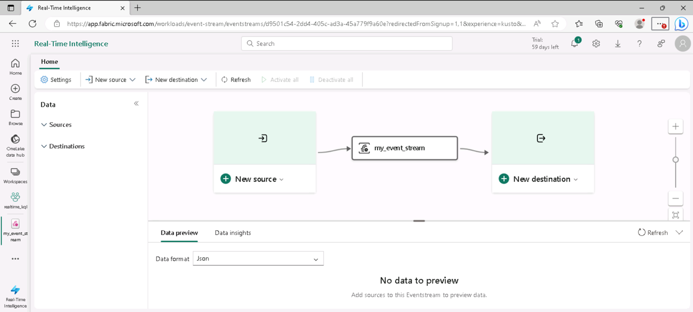

---
lab:
  title: 探索 Microsoft Fabric 的即時分析
  module: Explore fundamentals of large-scale data analytics
---

# 探索 Microsoft Fabric 的即時分析

您將透過此練習探索 Microsoft Fabric 的即時分析。

此實驗室需要大約 **25** 分鐘才能完成。

> **注意**：您需要 Microsoft Fabric 授權才能完成此練習。 如需如何啟用免費 Fabric 試用版授權的詳細資訊，請參閱[開始使用 Fabric](https://learn.microsoft.com/fabric/get-started/fabric-trial)。 您需要 Microsoft *學校*或*公司*帳戶才能執行此動作。 如您尚未擁有，您可[註冊 Microsoft Office 365 E3 或更高版本的試用版](https://www.microsoft.com/microsoft-365/business/compare-more-office-365-for-business-plans)。

## 建立工作區

在運用 Fabric 的資料之前，請先啟用 Fabric 試用版並建立工作區。

1. 您可在 `https://app.fabric.microsoft.com` 登入 [Microsoft Fabric](https://app.fabric.microsoft.com)。
2. 在左側功能表列，選取 [工作區]**** (圖示看起來類似 )。
3. 以您選擇的名稱建立新工作區，在 [進階]**** 區段選取包含 Fabric 容量 (*試用版*、*進階版*或 *Fabric*) 的授權模式。
4. 當新工作區開啟時，應為空白。

    

## 建立 KQL 資料庫

現在您已擁有工作區，您可建立 KQL 資料庫來儲存即時資料。

1. 在入口網站左下方，切換至 [即時智慧]**** 體驗。

    

    [即時智慧] 首頁包含用來建立常用資產以進行即時資料分析的圖格。

2. 在 [即時智慧] 首頁中，使用您選擇的名稱建立新的 **Eventhouse**。

    ![RTA 編輯器的螢幕擷取畫面，其中已醒目提示 [建立 KQL DB]。](./images/create-kql-db.png)

    Eventhouse 用來跨專案分組和管理您的資料庫。 系統會使用 Eventhouse 的名稱自動建立空的 KQL 資料庫，而且我們稍後將在本練習中將資料新增至其中。

## 建立 Eventstream

Eventstreams 提供可調整且彈性的方式，從串流來源擷取即時資料。

1. 在左側功能表列中，選取即時智慧體驗的 [首頁]**** 頁面。
1. 在首頁，選取圖格並以您選擇的名稱建立新 **Eventstream**。

    在短時間內，會顯示 Eventstream 的視覺化設計工具。

    

    視覺化設計工具畫布會顯示連線 Eventstream 的來源，而 Eventstream 接著會連線目的地。

1. 在設計工具畫布，於來源的 [新來源]**** 清單，選取 [範例資料]****。 然後在 [範例資料]**** 窗格，指定名稱 [計程車]****，然後選取 [黃色計程車]**** 範例資料 (代表從計程車車程收集的資料)。 然後選取 [新增]。
1. 在設計工具畫布下方，選取 [資料預覽]**** 索引標籤，預覽從來源串流的資料：

    

1. 在設計工具畫布，於目的地的 [新目的地]**** 清單，選取 [KQL 資料庫]****。 然後在 [KQL 資料庫]**** 窗格，指定目的地名稱 [taxi-data]****，然後選取您的工作區與 KQL 資料庫。 選取 [目的地] 資料表下方的 [建立新項目]****，然後輸入資料表名稱 **taxi-data**。 然後選取 [新增]。
1. 確認已完成的 Eventstream 如下所示：

    

## 查詢 KQL 資料庫的即時資料

您的 Eventstream 會持續填入 KQL 資料庫的資料表，讓您能夠查詢即時資料。

1. 在左側功能表中樞，選取 KQL 資料庫 (或選取工作區，並在該處尋找 KQL 資料庫)。
1. 在 [計程車資料]**** 資料表 (已透過 Eventstream 建立) 的 [...]**** 功能表，選取 [查詢資料表 > 過去 24 小時內擷取的記錄]****。

    ![螢幕擷取畫面：KQL 資料庫的 [查詢資料表] 功能表。](./images/kql-query.png)

1. 檢視查詢結果，應為如下所示的 KQL 查詢：

    ```kql
    ['taxi-data']
    | where ingestion_time() between (now(-1d) .. now())
    ```

    結果會顯示過去 24 小時內從串流來源擷取的所有計程車記錄。

1. 以下列程式碼取代查詢編輯器上半部的所有 KQL 查詢程式碼：

    ```kql
    // This query returns the number of taxi pickups per hour
    ['taxi-data']
    | summarize PickupCount = count() by bin(todatetime(tpep_pickup_datetime), 1h)
    ```

1. 使用 [▷ 執行]**** 按鈕來執行查詢並檢閱結果，其中顯示每小時計程車搭載次數。

## 清除資源

如您已完成探索 Microsoft Fabric 的即時分析，您可刪除為此練習建立的工作區。

1. 在左側列，選取工作區圖示即可檢視其所包含的所有項目。
2. 在工具列的 [...]**** 功能表，選取 [工作區設定]****。
3. 在 [其他]**** 區段，選取 [移除此工作區]****。
