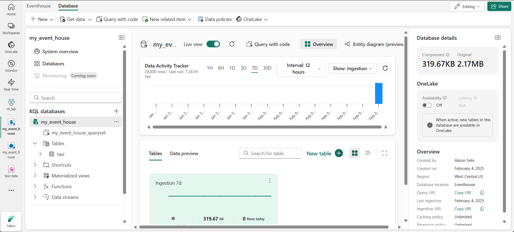

---
lab:
  title: 探索 Microsoft Fabric 的即時分析
  module: Explore real-time analytics in Microsoft Fabric
---

# 探索 Microsoft Fabric 的即時分析

Microsoft Fabric 提供即時智慧，可讓您建立即時資料串流的分析解決方案。 在本練習中，您將使用 Microsoft Fabric 中的即時智慧功能來擷取、分析和視覺化來自計程車公司的即時資料流程。

此實驗室需要大約 **30** 分鐘才能完成。

> **附註**： 您需要 [Microsoft Fabric 租用戶](https://learn.microsoft.com/fabric/get-started/fabric-trial) 才能完成此練習。

## 建立工作區

在 Fabric 中使用資料之前，您必須先建立已啟用 Fabric 容量的工作區。

> _**提示**： 工作區是您建立的所有內容 （事件串流、事件屋、儀表板） 的容器。Fabric 容量可讓這些專案執行。_

1. 在瀏覽器中流覽至 [Microsoft Fabric 首頁](https://app.fabric.microsoft.com/home?experience=fabric)`https://app.fabric.microsoft.com/home?experience=fabric`，然後使用您的 Fabric 認證登入。

1. 在左側功能表列，選取 [工作區]**** (圖示看起來類似 )。

1. 使用您選擇的名稱建立新的工作區，並選取包含 Fabric 容量 （*試用*版、 *進階版*或 *Fabric*） 的授權模式。

    > _**提示**： 使用包含 Fabric 的容量可確保工作區具有即時擷取和分析所需的引擎。獨立的工作區可隔離實驗室資源，且易於清理。_

1. 當新工作區開啟時，應為空白。

    

## 建立 Eventstream

現在您已準備好從串流來源尋找和擷取即時資料。 若要這樣做，您將從 Fabric Real-Time Hub 開始。

> _**提示**： 即時中心集中了串流來源，並可以輕鬆連接它們。事件串流會將來源拼接至目的地，並可在兩者之間新增轉換。_

> **提示**： 第一次使用「即時中心」時，可能會顯示一些 *入門* 提示。 您可以關閉這些。

1. 在左側的功能表列中，選取 **[即時]** 中樞。

    即時中心提供尋找和管理串流資料來源的簡單方法。

    

1. 在即時中樞的 [連線至 **] **區段中，選取 **[資料來源]。**

1. 尋找**黃色計程車**範例資料來源，然後選取 **[連線]。** 然後在「連線」**精靈中，為來源`taxi`命名，並編輯預設事件串流名稱以將其變更為 `taxi-data`。** 與此資料相關聯的預設資料流程將自動命名 *為taxi-data-stream*：

    > _**提示**： 黃色計程車範例是安全的公開串流 （不需要認證），而且對所有學習者來說都是一致的。清晰的名稱可讓您更輕鬆地找到來源、事件串流和稍後的串流。_

    

1. 選取 [下一步 **]**，並等候建立來源和事件資料流程，然後選取 [開啟事件資料流程 **]。** 事件資料流會在設計畫布上顯示 **計程車** 來源和 **計程車資料流** ：

   

## 建立 eventhouse

事件串流會擷取即時計程車資料，但目前不會執行任何動作。 讓我們建立一個事件屋，我們可以將捕獲的資料儲存在表格中。

> _**提示**： 事件室提供您持久的儲存體和 KQL 資料庫，讓您可以保存資料流程並在稍後查詢，即使新事件抵達也一樣。KQL （Kusto 查詢語言） 是一種唯讀、類似 SQL 的語言，可用來快速探索、篩選和分析大型資料集_

1. 在左側的功能表列上，選取 **[建立**]。 在 [*新增*] 頁面的 [即時智慧 *] *區段下，選取 [**Eventhouse**]。 給它一個您選擇的唯一名稱。

    >**備註**：如果「建立」**** 選項未固定到側邊欄，則需要先選取省略號 （**...**） 選項。

    

    關閉顯示的所有提示或提示，直到您看到新的空活動室為止。

    

1. 在左側窗格中，請注意您的事件屋包含與事件屋同名的 KQL 資料庫。 您可以為此資料庫中的即時資料建立表格，或視需要建立其他資料庫。

1. 選取資料庫，並注意有一個相關聯 *的查詢集*。 此檔案包含一些範例 KQL 查詢，可用來開始查詢資料庫中的資料表。

    > _**提示**： KQL 資料庫會保留您的資料表。查詢集是編寫和執行查詢的便利位置，無需額外設定。_

    不過，目前沒有要查詢的資料表。 讓我們透過將資料從事件流中獲取到新表來解決這個問題。

1. 在 KQL 資料庫的首頁中，選取 [ **取得資料**]。

    

1. 針對資料來源，選取 **[事件流**** > ] [現有事件流]。**

1. 在 [選取或建立目的地資料表 **] **窗格中，建立名為 的新資料表`taxi`。 然後在 設定資料來源** 窗**格中，選取您的工作區和 **taxi-data** 事件串流，並將連線`taxi-table`命名為 。

   

1. 使用 [下一步 **] **按鈕完成檢查資料的步驟，然後**完成**設定。 然後關閉配置窗口以查看帶有出租車表的事件屋。

   

    串流與資料表之間的連線已建立。 讓我們在事件流中驗證這一點。

1. 在左側的功能表列中，選取 [**即時]** 中樞，然後檢視 [ 我的資料串流** ] **頁面。 在 taxi-data-stream** 串流的 **...** 功能表中**，選取 [開啟事件串流 **]。**

    事件資料流現在會顯示資料流程的目的地：

   

    > _**提示**： 在設計畫布上選取目的地，如果其下方未顯示資料預覽，請選取 **重新整理。**_

    > _**提示**：在事件流中驗證可確認事件正在流向目的地。預覽可能會快取 — 重新整理會提取最新的範例。_

    在本練習中，您已建立一個非常簡單的事件串流，可擷取即時資料並將其載入到資料表中。 在實際解決方案中，您通常會新增轉換，以彙總時間視窗內的資料 （例如，擷取每隻股票在五分鐘期間的平均價格）。

    現在讓我們探討如何查詢和分析捕獲的資料。

## 查詢擷取的資料

事件資料流會擷取即時計程車票價資料，並將它載入到 KQL 資料庫中的資料表中。 您可以查詢此表以查看捕獲的資料。

> _**提示**： KQL 專為快速探索帶有時間戳記的大量資料而設計。查詢可讓您驗證擷取並立即開始分析。_

1. 在左側的功能表列中，選取您的事件屋資料庫。

1. 選取 *資料庫的查詢集* 。

1. 在查詢窗格中，修改第一個範例查詢，如下所示：

    ```kql
    taxi
    | take 100
    ```

    > _**提示**： `take 100` 是快速健康情況檢查 — 確認列是否到達並檢查小樣本，而無需掃描所有內容。_

1. 選取查詢程式碼並執行它，以查看資料表中的 100 列資料。

    

1. 檢閱結果，然後修改查詢以顯示每小時的計程車上車次數：

    ```kql
    taxi
    | summarize PickupCount = count() by bin(todatetime(tpep_pickup_datetime), 1h)
    ```

1. 反白顯示已修改的查詢並執行它以查看結果。

    > _**提示**： `bin(..., 1h)` 將事件分組為每小時的儲存貯體，以便輕鬆發現一段時間內的趨勢。_

1. 等待幾秒鐘，然後再次執行它，請注意，當從即時串流將新資料新增至表格時，拾取數量會變更。

    > _**提示**： 串流會不斷新增資料，因此結果會隨著時間而變更。重新執行會顯示彙總如何在新事件到達時更新。_

## 清除資源

在本練習中，您已建立事件室、使用事件資料流程擷取即時資料、查詢 KQL 資料庫資料表中擷取的資料、建立即時儀錶板以視覺化即時資料，以及使用 Activator 設定警示。

如果您已完成 Fabric 中的 Real-Time Intelligence 探索，您可以刪除您針對本練習建立的工作區。

> _**提示**： 刪除工作區會移除實驗室中建立的所有項目，並有助於防止持續收費。_

1. 在左側的列中，選取工作區的圖示。

1. 在工具列中，選取 **[工作區設定**]。

1. 在 [ 一般 ] **區段中，選取 [ **移除此工作區**]。**
