---
lab:
  title: 探索 Power BI 資料視覺效果的基本概念
  module: Explore fundamentals of data visualization
---

# <a name="explore-fundamentals-of-data-visualization-with-power-bi"></a>探索 Power BI 資料視覺效果的基本概念

在此練習中，您必須使用 Microsoft Power BI Desktop 建立一個資料模型，以及一份包含互動式資料視覺效果的報告。

此實驗室需要大約 **20** 分鐘才能完成。

## <a name="before-you-start"></a>開始之前

您將需要具有系統管理層級存取權的 [Azure 訂用帳戶](https://azure.microsoft.com/free)。

### <a name="install-power-bi-desktop"></a>安裝 Power BI Desktop

如果 Windows 電腦上尚未安裝 Microsoft Power BI Desktop，可以免費下載安裝。

1. 從 [https://aka.ms/power-bi-desktop](https://aka.ms/power-bi-desktop?azure-portal=true) 下載 Power BI Desktop 安裝程式。
1. 下載檔案後，請開啟檔案，並使用安裝精靈在您的電腦上安裝 Power BI Desktop。 此安裝可能需要幾分鐘的時間。

## <a name="import-data"></a>匯入資料

1. 開啟 Power BI Desktop。 應用程式介面應會如下所示：

    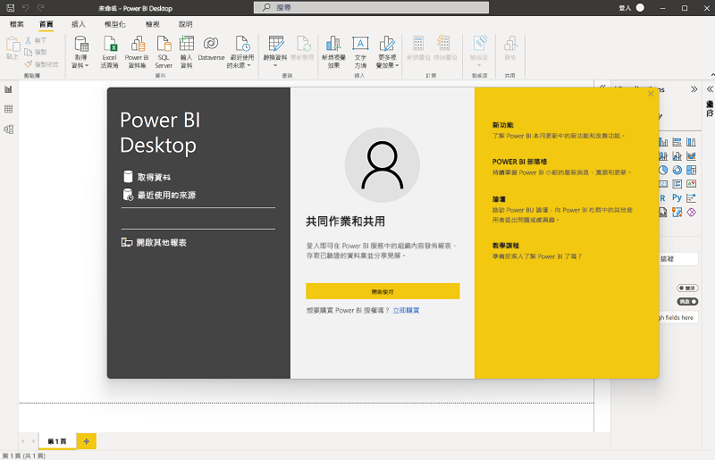

    現在您已準備好匯入報表的資料。

1. 在 Power BI Desktop 歡迎畫面上，選取 [取得資料]，然後在資料來源清單中選取 [Web]，再選取 [連線]。

    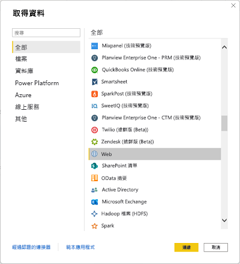

1. 在 [從 Web] 對話方塊中輸入下列 URL，然後選取 [確定]：

    ```
    https://github.com/MicrosoftLearning/DP-900T00A-Azure-Data-Fundamentals/raw/master/power-bi/customers.csv
    ```

1. 在 [存取 Web 內容] 對話方塊中，選取 [連線]。

1. 確認 URL 會開啟包含客戶資料的資料集，如下所示。 然後選取 [載入]，將資料載入至報表的資料模型。

    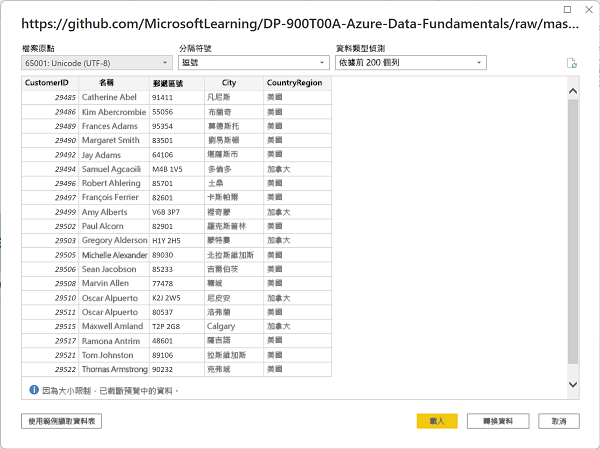

1. 在主要 Power BI Desktop 視窗的 [取得資料] 功能表中，選取 [Web]：

    ![螢幕擷取畫面：Power BI 中的 [取得資料] 功能表。](images/get-data.png)

1. 在 [從 Web] 對話方塊中輸入下列 URL，然後選取 [確定]：

    ```
    https://github.com/MicrosoftLearning/DP-900T00A-Azure-Data-Fundamentals/raw/master/power-bi/products.csv
    ```

1. 在對話方塊中，選取 [載入] 將此檔案中的產品資料載入資料模型。

1. 重複上述三個步驟，從下列 URL 匯入包含訂單資料的第三個資料集：

    ```
    https://github.com/MicrosoftLearning/DP-900T00A-Azure-Data-Fundamentals/raw/master/power-bi/orders.csv
    ```

## <a name="explore-a-data-model"></a>探索資料模型

您匯入的三個資料表已載入至資料模型，現在要探索資料模型並縮小搜尋範圍。

1. 在 Power BI Desktop 的最左側選取 [模型] 索引標籤，然後排列模型中的資料表以便看見這些項目。 您可以使用 **>>** 圖示來隱藏右側的窗格：

    ![螢幕擷取畫面：Power BI 中的 [模型] 索引標籤。](images/model-tab.png)

1. 在 [orders]\(訂單\) 資料表中，選取 [Revenue]\(營收\) 欄位，然後在 [屬性] 窗格中，將其 [格式] 屬性設為 [貨幣]：

    ![螢幕擷取畫面：如何在 Power BI 中將 [營收格式] 設定為 [貨幣]。](images/revenue-currency.png)

    此步驟可確保營收值在報表視覺效果中顯示為貨幣。

1. 在產品資料表中，以滑鼠右鍵按一下 [類別] 欄位 (或開啟其 **&vellip;** 功能表)，然後選取 [建立階層]。 此步驟會建立名為**類別階層**的階層。 您可能需要在 [產品] 資料表中展開或捲動，才能看到此資料，也可以在 [欄位] 窗格中看到此資料：

    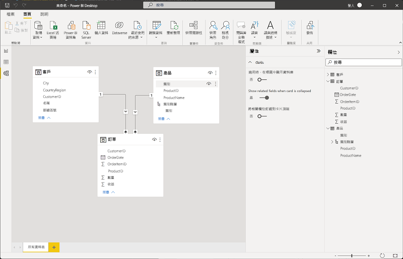

1. 在產品資料表中，以滑鼠右鍵按一下 [ProductName] 欄位 (或開啟其 **&vellip;** 功能表)，然後選取 [新增至階層] > [類別階層]。 這會將 [ProductName] 欄位新增至您先前建立的階層。
1. 在 [欄位] 窗格中，以滑鼠右鍵按一下 [類別階層] (或開啟其 [...] 功能表)，然後選取 [重新命名]。 然後將階層重新命名為**已分類產品**。

    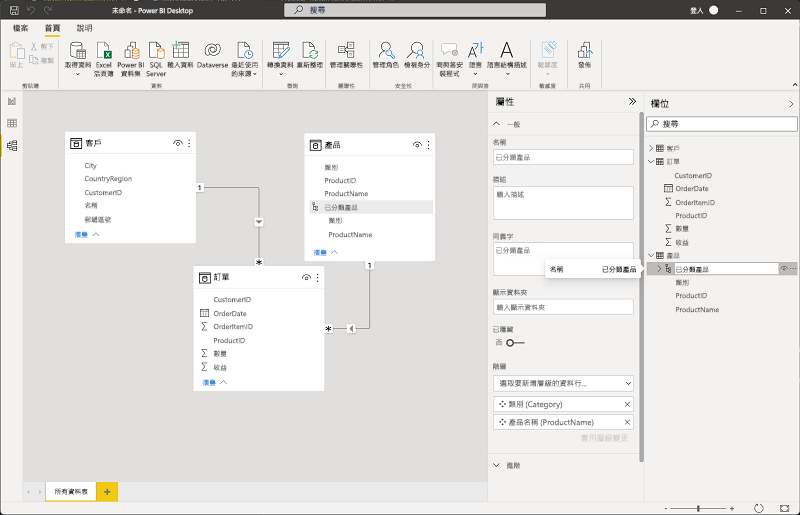

1. 在最左側選取 [資料] 索引標籤，然後在 [欄位] 窗格中選取 [客戶] 資料表。
1. 選取 [City]\(城市\) 資料行標頭，然後將其 [資料類別] 屬性設為 [城市]：

    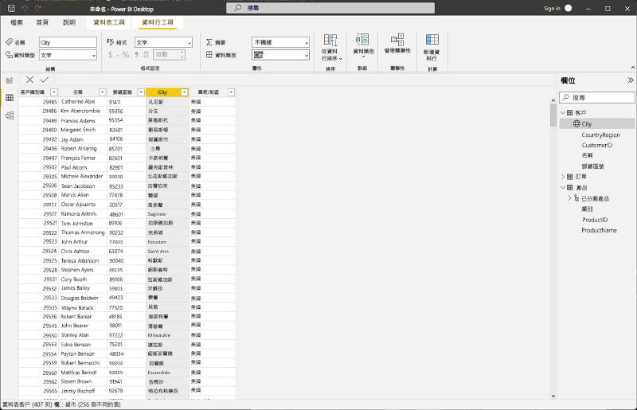

    此步驟可確保將此資料行中的值解讀為城市名稱，如果想要加入地圖視覺效果，這會相當有用。

## <a name="create-a-report"></a>建立報表

現在幾乎已做好建立報表的準備工作。 首先需檢查幾項設定，確保所有視覺效果皆已啟用。

1. 在 [檔案] 功能表中，選取 [選項及設定]。 然後選取 [選項]，並在 [安全性] 區段中，確保已啟用 [使用地圖及區域分布圖視覺效果]，再選取 [確定]。

    ![螢幕擷取畫面：如何在 PowerBI 中設定 [使用地圖] 和 [填滿地圖] 視覺效果屬性。](images/set-options.png)

    此設定可確保您可以在報表中加入地圖視覺效果。

1. 在最左側選取 [報表] 索引標籤，並檢視報表設計介面。

    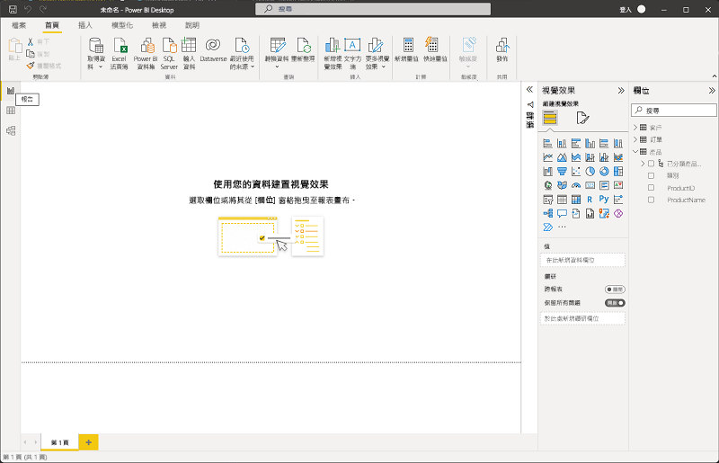

1. 在功能區的報表設計介面上方，選取 [文字方塊]，然後將包含**銷售報告**文字的文字方塊新增至報表。 將文字格式設為粗體，字型大小為 32。

    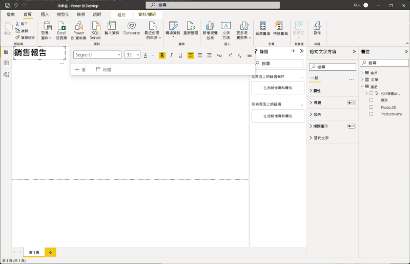

1. 選取報表上的任何空白區域，以取消選取文字方塊。 然後在 [欄位] 窗格中，展開 [產品] 並選取 [Categorized Products]\(已分類產品\) 欄位。 將資料表新增至報表。

    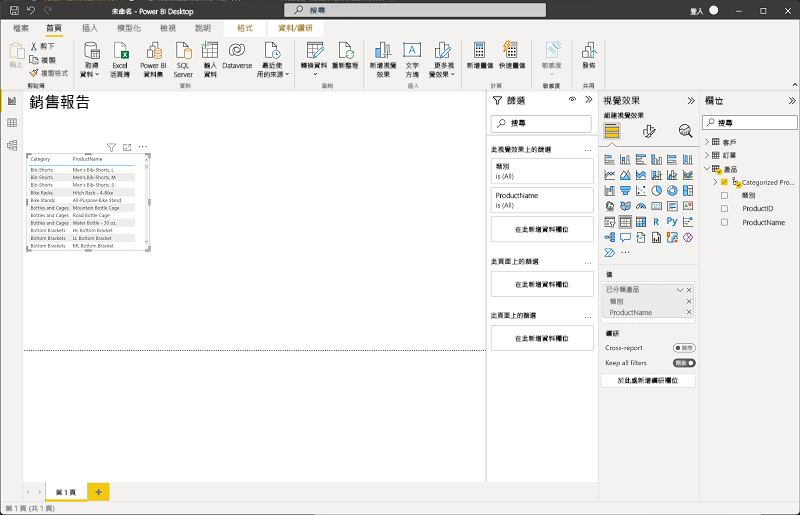

1. 在資料表仍為選取的狀態下，在 [欄位] 窗格中展開 [Orders]\(訂單\)，並選取 [Revenue]\(營收\)。 [營收] 資料行會新增至資料表。 您可能需要擴充資料表的大小，才能看到該資料行。

    如您在模型中所指定的格式，營收的格式設為貨幣。 不過您未指定小數位數，因此這些值會具有小數點。 這對即將建立的視覺效果影響不大，但若有需要，可返回 [模型] 或 [資料] 索引標籤變更小數位數。

    

1. 在資料表仍為選取的狀態下，在 [視覺效果] 窗格中選取 [堆疊直條圖] 視覺效果。 資料表會變更為直條圖，顯示依類別劃分的營收。

    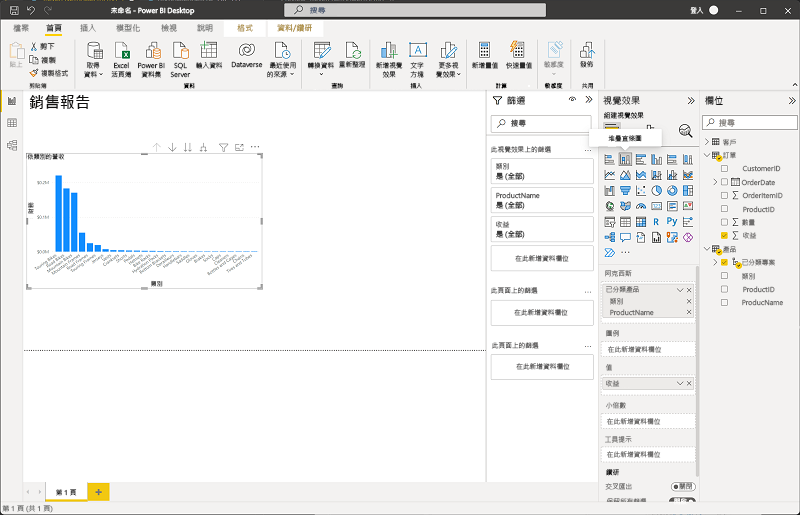

1. 在選取的直條圖上方，選取 **&#8595;** 圖示，以開啟向下切入。 然後在圖表中選取第二個資料行 [Road Bikes]\(公路自行車\)，以向下切入並查看此類別中個別產品的營收。 因為您已定義類別和產品的階層，這項功能可以達成。

    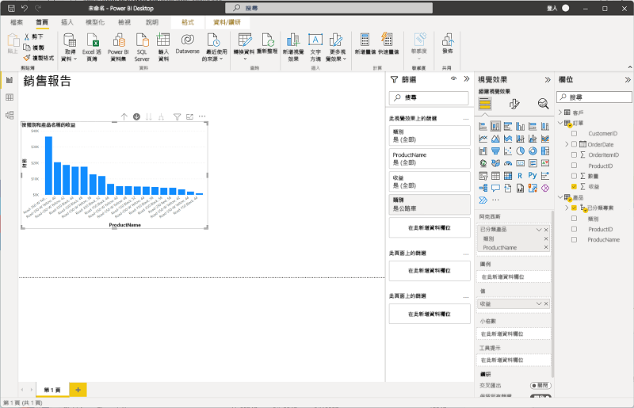

1. 使用 **&#x2191;** 圖示，以反向切入類別層級。 然後選取 **(** &#8595; **)** 圖示，關閉向下切入功能。
1. 選取報表的空白區域，然後在 [欄位] 窗格中選取 [訂單] 資料表中的 [數量] 欄位，以及 [產品] 資料表中的 [類別] 欄位。 此步驟會讓另一個直條圖依產品類別顯示銷售數量。
1. 選取新的直條圖之後，在 [視覺效果] 窗格中選取 [圓形圖]，然後調整圖表大小，並將其放在依類別劃分的營收直條圖旁邊。

    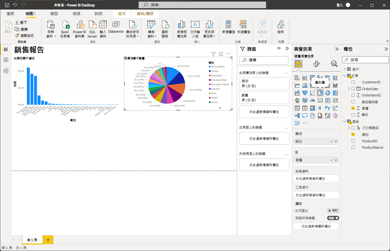

1. 選取報表的空白區域，然後在 [欄位] 窗格中選取 [customers]\(客戶\) 資料表中的 [City]\(城市\) 欄位，然後選取 [orders]\(訂單\) 資料表中的 [Revenue]\(營收\) 欄位。 如此會產生依城市顯示銷售營收的地圖。 視需要重新排列和調整視覺效果大小：

    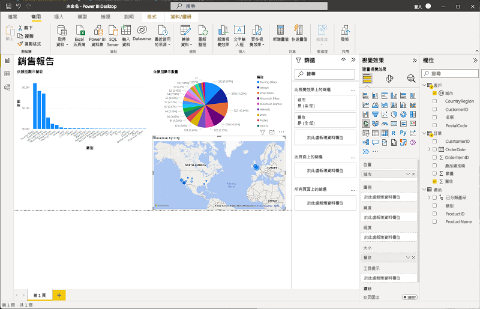

1. 請注意，在地圖中可以拖曳、按兩下、使用滑鼠滾輪，或在觸控式螢幕上捏合並拖曳來互動。 然後請選取特定城市，並留意報表中的其他視覺效果會有所變動，以醒目提示所選城市的資料。

    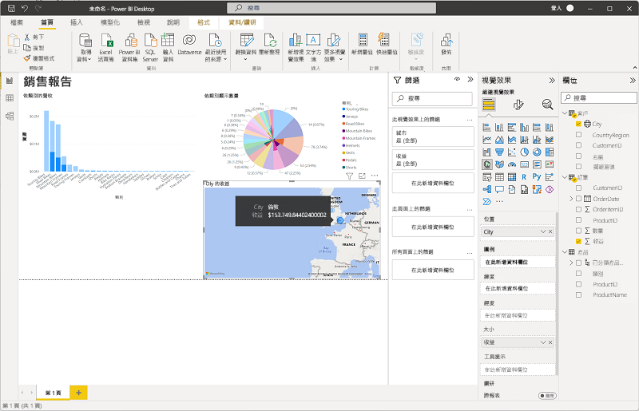

1. 在 [檔案] 功能表上，選取 [儲存]。 然後使用適當的 .pbix 檔案名稱儲存檔案。 您可以開啟檔案，並進一步探索資料模型化和視覺化的效果。

如果您有 [Power BI 服務](https://www.powerbi.com/?azure-portal=true)訂閱，可登入您的帳戶，並將報表發佈至 Power BI 工作區。 
