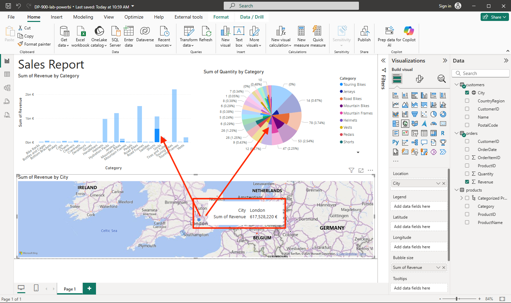

---
lab:
  title: 探索 Power BI 資料視覺效果的基本概念
  module: Explore fundamentals of data visualization
---

# 探索 Power BI 資料視覺效果的基本概念

完成此實驗室後，您將瞭解如何從 Power BI Desktop 中的多個來源匯入資料並建立模型、建立關聯性和階層以進行更深入的分析，以及設定資料格式和分類以增強視覺效果。 您將使用表格、圖表和地圖建立互動式報表，並透過向下切入和交叉醒目提示功能探索資料深入解析。 這些技能將使您能夠將原始數據轉化為引人注目的視覺故事和可操作的商業智慧。

此實驗室需要大約 **20** 分鐘才能完成。

## 安裝 Power BI Desktop

如果 Windows 電腦上尚未安裝 Microsoft Power BI Desktop，可以免費下載安裝。

> _**提示**： Power BI Desktop 是撰寫工具，您可以在共用模型和報表之前在本機建置它們。它可以免費安裝以進行學習和原型設計。_

1. 從 [https://aka.ms/power-bi-desktop](https://aka.ms/power-bi-desktop?azure-portal=true) 下載 Power BI Desktop 安裝程式。

1. 下載檔案後，請開啟檔案，並使用安裝精靈在您的電腦上安裝 Power BI Desktop。 此安裝可能需要幾分鐘的時間。

## 匯入資料

1. 開啟 Power BI Desktop。 應用程式介面應會如下所示：

    

    現在您已準備好匯入報表的資料。

1. 在 Power BI Desktop 歡迎畫面上，選取 **[從其他來源取得資料]**，然後在資料來源清單中選取 **[Web**]，然後選取 **[連線]。**

    

1. 在 [從 Web]**** 對話方塊中輸入下列 URL，然後選取 [確定]****：

    ```
    https://github.com/MicrosoftLearning/DP-900T00A-Azure-Data-Fundamentals/raw/master/power-bi/customers.csv
    ```

    > _**提示**：將 Web 連接器與範例 CSV 檔案搭配使用，表示每個人都可以使用相同的乾淨資料進行工作，無需本機檔案或認證。_

1. 在 [存取 Web 內容] 對話方塊中，選取 [連線]****。

1. 確認 URL 會開啟包含客戶資料的資料集，如下所示。 然後選取 [載入]****，將資料載入至報表的資料模型。

    

    > _**提示**： 對於此實驗室來說，直接載入資料是最快的。如有需要，您隨時可以稍後在 Power Query 中套用轉換。_

1. 在主要 Power BI Desktop 視窗的 [取得資料]**** 功能表中，選取 [Web]****：

    ![螢幕擷取畫面：Power BI 中的 [取得資料] 功能表。](images/get-data.png)

1. 在 [從 Web]**** 對話方塊中輸入下列 URL，然後選取 [確定]****：

    ```
    https://github.com/MicrosoftLearning/DP-900T00A-Azure-Data-Fundamentals/raw/master/power-bi/products.csv
    ```

1. 在對話方塊中，選取 [載入]**** 將此檔案中的產品資料載入資料模型。

1. 重複上述三個步驟，從下列 URL 匯入包含訂單資料的第三個資料集：

    ```
    https://github.com/MicrosoftLearning/DP-900T00A-Azure-Data-Fundamentals/raw/master/power-bi/orders.csv
    ```

    > _**提示**： 引入客戶、產品和訂單會建立一個小型、逼真的模型。多個相關表格可讓您跨實體進行分析 （例如，依產品類別和城市劃分的收入）。_

## 探索資料模型

您匯入的三個資料表已載入至資料模型，現在要探索資料模型並縮小搜尋範圍。

1. 在 Power BI Desktop 的最左側選取 [模型]**** 索引標籤，然後排列模型中的資料表以便看見這些項目。 您可以使用 **>>** 圖示來隱藏右側的窗格：

    ![螢幕擷取畫面：Power BI 中的 [模型] 索引標籤。](images/model-tab.png)

1. 在 [orders]\(訂單\)**** 資料表中，選取 [Revenue]\(營收\)**** 欄位，然後在 [屬性]**** 窗格中，將其 [格式]**** 屬性設為 [貨幣]****：

    ![螢幕擷取畫面：如何在 Power BI 中將 [營收格式] 設定為 [貨幣]。](images/revenue-currency.png)

    此步驟可確保營收值在報表視覺效果中顯示為貨幣。

    > _**提示**： 格式化量值可改善視覺效果的可讀性，並使數字與業務使用者預期看到的方式保持一致。_

1. 在產品資料表中，以滑鼠右鍵按一下 [類別]**** 欄位 (或開啟其 **&vellip;** 功能表)，然後選取 [建立階層]****。 此步驟會建立名為**類別階層**的階層。 您可能需要在 [產品]**** 資料表中展開或捲動，才能看到此資料，也可以在 [欄位]**** 窗格中看到此資料：

    

1. 在產品資料表中，以滑鼠右鍵按一下 [ProductName]**** 欄位 (或開啟其 **&vellip;** 功能表)，然後選取 [新增至階層]**** > [類別階層]****。 這會將 [ProductName]**** 欄位新增至您先前建立的階層。

    

1. 在 [欄位]**** 窗格中，以滑鼠右鍵按一下 [類別階層]**** (或開啟其 [...]**** 功能表)，然後選取 [重新命名]****。 然後將階層重新命名為**已分類產品**。

    

    > _**提示**： 類別→產品階層可讓您向下切入視覺效果，因此檢視者可以從摘要到詳細資料進行探索。_

1. 在左側邊緣，選取 [資料表檢視 **] **索引標籤，然後在 [**資料**] 窗格中，選取 **[客戶**] 資料表。

1. 選取 [City]\(城市\)**** 資料行標頭，然後將其 [資料類別]**** 屬性設為 [城市]****：

    

    此步驟可確保將此資料行中的值解讀為城市名稱，如果想要加入地圖視覺效果，這會相當有用。

    > _**提示**： 資料類別可協助 Power BI 正確地對位置進行地理編碼，讓地圖視覺效果將點放置在正確的位置。_

## 建立報表

現在幾乎已做好建立報表的準備工作。 首先需檢查幾項設定，確保所有視覺效果皆已啟用。

1. 在 [檔案]**** 功能表中，選取 [選項及設定]****。 然後選取 [選項]****，並在 [安全性]**** 區段中，確保已啟用 [使用地圖及區域分布圖視覺效果]****，再選取 [確定]****。

    ![螢幕擷取畫面：如何在 PowerBI 中設定 [使用地圖] 和 [填滿地圖] 視覺效果屬性。](images/set-options.png)

    此設定可確保您可以在報表中加入地圖視覺效果。

    > _**提示**： 地圖視覺效果在某些環境中會關閉。啟用它們可確保地圖視覺效果出現在視覺化窗格中。_

1. 在最左側選取 [報表檢視]**** 索引標籤，並檢視報表設計介面。

    

1. 在功能區的報表設計介面上方，選取 [文字方塊]****，然後將包含**銷售報告**文字的文字方塊新增至報表。 將文字格式設為粗體，字型大小為 32。

    

    > _**提示**：清晰的標題有助於使用者一目了然地了解報告的目的。_

1. 選取報表上的任何空白區域，以取消選取文字方塊。 然後在 [資料]**** 窗格中，展開 [產品]**** 並選取 [已分類產品]**** 欄位。 將資料表新增至報表。

    

    > _**提示**： 現在使用階層欄位可讓您切換至支援順暢向下切入的視覺效果。_

1. 在資料表仍為選取的狀態，在 [資料]**** 窗格中展開 [訂單]****，並選取 [營收]****。 [營收] 資料行會新增至資料表。 您可能需要擴充資料表的大小，才能看到該資料行。

    如您在模型中所指定的格式，營收的格式設為貨幣。 不過您未指定小數位數，因此這些值會具有小數點。 這對即將建立的視覺效果影響不大，但若有需要，可返回 [模型]**** 或 [資料]**** 索引標籤變更小數位數。

    

1. 在資料表仍為選取的狀態下，在 [視覺效果]**** 窗格中選取 [堆疊直條圖]**** 視覺效果。 資料表會變更為直條圖，顯示依類別劃分的營收。

    

    > _**提示**：長條圖可讓您輕鬆地並排比較類別。_

1. 在選取的直條圖上方，選取 **&#8595;** 圖示，以開啟向下切入。 然後在圖表中，選取任何欄以向下切入，並查看此類別中個別產品的收入。 因為您已定義類別和產品的階層，這項功能可以達成。

    

    > _**提示**：向下切入可視需要顯示細節，而不會使視圖混亂，非常適合分層洞察。_

1. 使用 **&#x2191;** 圖示，以反向切入類別層級。 然後選取 **(**&#8595;**)** 圖示，關閉向下切入功能。

1. 選取報表的空白區域，然後在 [資料]**** 窗格中選取 [訂單]**** 資料表的 [數量]**** 欄位，以及 [產品]**** 資料表的 [類別]**** 欄位。 此步驟會讓另一個直條圖依產品類別顯示銷售數量。

1. 選取新的直條圖之後，在 [視覺效果]**** 窗格中選取 [圓形圖]****，然後調整圖表大小，並將其放在依類別劃分的營收直條圖旁邊。

    

    > _**提示**：將類別的數量顯示為圓形圖，會突出顯示比例貢獻，並補充收入直條圖。_

1. 選取報表的空白區域，然後在 [資料]**** 窗格中選取 [客戶]**** 資料表的 [城市]**** 欄位，然後選取 [訂單]**** 資料表的 [營收]**** 欄位。 如此會產生依城市顯示銷售營收的地圖。 視需要重新排列和調整視覺效果大小：

    

    > _**提示**：按城市繪製收入地圖可新增地理視角，表格或圖表中不明顯的模式可能會在地圖上彈出。_

1. 請注意，在地圖中可以拖曳、按兩下、使用滑鼠滾輪，或在觸控式螢幕上捏合並拖曳來互動。 然後請選取特定城市，並留意報表中的其他視覺效果會有所變動，以醒目提示所選城市的資料。

    

    > _**提示**： 交叉醒目提示可讓使用者與單一視覺效果互動，並查看整個頁面的相關變更，將靜態報表變成互動式體驗。_

1. 在 [檔案]**** 功能表上，選取 [儲存]****。 然後使用適當的 .pbix 檔案名稱儲存檔案。 您可以開啟檔案，並進一步探索資料模型化和視覺化的效果。

    > _**提示**： 儲存 .pbix 會將您的模型、查詢和報表保留在一起，以便您稍後重新開啟和逐一查看。_

如果您有 [Power BI 服務](https://www.powerbi.com/?azure-portal=true)訂閱，可登入您的帳戶，並將報表發佈至 Power BI 工作區。 

> **提示**： 發佈至 Power BI 服務可讓您共用報表、排程重新整理，以及與工作區中的其他人共同作業。
